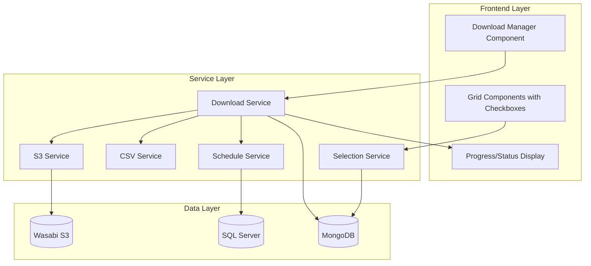
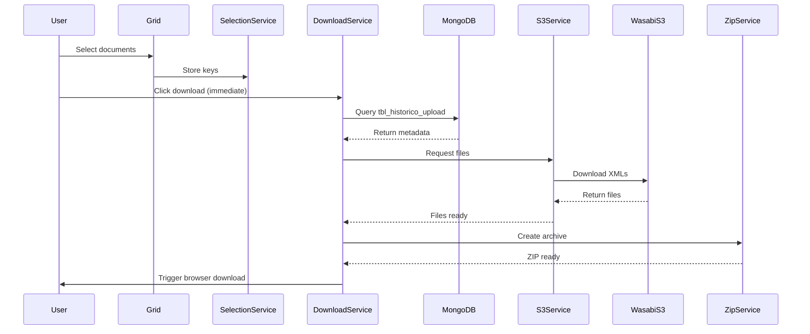
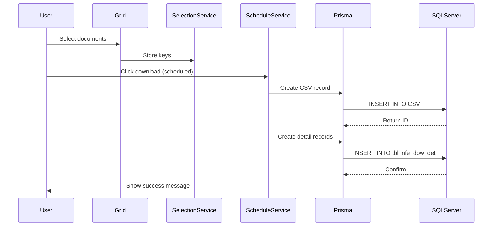

# Design Document

## Overview

The document download system enables users to select fiscal documents from MongoDB collections and either download them immediately as a ZIP package from Wasabi S3 storage or schedule the download for external processing via SQL Server. The system integrates with existing grid components, adds checkbox selection functionality, retrieves document metadata from MongoDB, fetches XML files from S3, generates optional CSV exports, and creates database records for scheduled downloads.

The architecture follows a modular approach with clear separation between UI components, business logic services, and data access layers. The system uses React for the frontend, AWS SDK for S3 integration, Prisma for SQL Server access, and JSZip for archive creation.

## Architecture

### High-Level Architecture



### Component Interaction Flow

**Immediate Download Flow:**


**Scheduled Download Flow:**


## Components and Interfaces

### 1. SelectionService

Manages document selection state across grid components. When a document is selected, its key is added to an in-memory Set (preventing duplicates). When a document is deselected, its key is immediately removed from memory.

```typescript
interface SelectionService {
  // Add document key to selection (no duplicates)
  addSelection(collectionType: CollectionType, key: string): void;
  
  // Remove document key from selection (removes from memory immediately)
  removeSelection(collectionType: CollectionType, key: string): void;
  
  // Get all selected keys
  getSelectedKeys(): Map<CollectionType, Set<string>>;
  
  // Clear all selections (removes all keys from memory)
  clearSelections(): void;
  
  // Get total count of selected documents
  getSelectionCount(): number;
  
  // Check if a specific key is selected
  isSelected(collectionType: CollectionType, key: string): boolean;
}

type CollectionType = 'NFE' | 'CTE' | 'CFE';

interface CollectionKeyMapping {
  NFE: 'CHV_NFE';
  CTE: 'CHV';
  CFE: 'CHV_CFe';
}

// Implementation uses Map<CollectionType, Set<string>> to ensure:
// 1. No duplicate keys per collection
// 2. Immediate removal when deselected
// 3. Efficient lookup and deletion operations
```

### 2. DownloadService

Orchestrates the immediate download process.

```typescript
interface DownloadService {
  // Execute immediate download
  downloadImmediate(options: DownloadOptions): Promise<DownloadResult>;
  
  // Get download progress
  getProgress(): DownloadProgress;
}

interface DownloadOptions {
  selectedKeys: Map<CollectionType, Set<string>>;
  includeCSV: boolean;
  collectionName: string;
}

interface DownloadResult {
  success: boolean;
  filesDownloaded: number;
  errors?: string[];
}

interface DownloadProgress {
  currentFile: number;
  totalFiles: number;
  currentFileName: string;
  status: 'idle' | 'fetching-metadata' | 'downloading' | 'zipping' | 'complete' | 'error';
}
```

### 3. S3Service

Handles interaction with Wasabi S3 storage.

```typescript
interface S3Service {
  // Initialize S3 client with credentials
  initialize(config: S3Config): void;
  
  // Download a single file from S3
  downloadFile(objectKey: string): Promise<Buffer>;
  
  // Download multiple files in parallel
  downloadFiles(objectKeys: string[]): Promise<Map<string, Buffer>>;
}

interface S3Config {
  endpoint: string;
  accessKeyId: string;
  secretAccessKey: string;
  bucketName: string;
  region?: string;
}
```

### 4. CSVService

Generates CSV files from document data.

```typescript
interface CSVService {
  // Generate CSV from document records
  generateCSV(documents: DocumentRecord[]): string;
  
  // Convert CSV string to Buffer for ZIP
  toBuffer(csvContent: string): Buffer;
}

interface DocumentRecord {
  [key: string]: any;
}
```

### 5. ScheduleService

Creates scheduled download records in SQL Server.

```typescript
interface ScheduleService {
  // Schedule a download for external processing
  scheduleDownload(options: ScheduleOptions): Promise<ScheduleResult>;
}

interface ScheduleOptions {
  selectedKeys: Map<CollectionType, Set<string>>;
  includeCSV: boolean;
  userId?: string;
}

interface ScheduleResult {
  success: boolean;
  scheduleId: number;
  recordsCreated: number;
}
```

### 6. DownloadManagerComponent

React component that provides the download UI.

```typescript
interface DownloadManagerProps {
  selectionService: SelectionService;
  collectionType: CollectionType;
  collectionName: string;
}

interface DownloadManagerState {
  downloadNow: boolean;
  includeCSV: boolean;
  isDownloading: boolean;
  progress: DownloadProgress;
}
```

### 7. GridWithSelection Component

Enhanced grid component with checkbox selection.

```typescript
interface GridWithSelectionProps<T> {
  data: T[];
  columns: GridColumn[];
  collectionType: CollectionType;
  selectionService: SelectionService;
  getDocumentKey: (row: T) => string;
}
```

## Data Models

### MongoDB Collections

**tbl_historico_upload:**
```typescript
interface HistoricoUpload {
  _id: string;           // S3 object key (hash)
  CHAVE: string;         // Document key (matches CHV_NFE, CHV, or CHV_CFe)
  ARQUIVO: string;       // Original filename
  DATA_UPLOAD?: Date;
  TAMANHO?: number;
}
```

**tbl_nfe_100:**
```typescript
interface NFe {
  CHV_NFE: string;       // Document key
  // ... other NFe fields
}
```

**tbl_cte_100:**
```typescript
interface CTe {
  CHV: string;           // Document key
  // ... other CTe fields
}
```

**tbl_cfe_100:**
```typescript
interface CFe {
  CHV_CFe: string;       // Document key
  // ... other CFe fields
}
```

### SQL Server Tables

**CSV Table:**
```sql
CREATE TABLE CSV (
  ID INT IDENTITY(1,1) PRIMARY KEY,
  STATUS INT NOT NULL,
  CSV INT NOT NULL,
  DATA_CRIACAO DATETIME DEFAULT GETDATE(),
  USUARIO VARCHAR(100)
)
```

**tbl_nfe_dow_det Table:**
```sql
CREATE TABLE tbl_nfe_dow_det (
  ID INT IDENTITY(1,1) PRIMARY KEY,
  CSV_ID INT NOT NULL,
  CHAVE VARCHAR(44) NOT NULL,
  STATUS INT NOT NULL,
  FOREIGN KEY (CSV_ID) REFERENCES CSV(ID)
)
```

### Prisma Schema

```prisma
model CSV {
  id          Int      @id @default(autoincrement()) @map("ID")
  status      Int      @map("STATUS")
  csv         Int      @map("CSV")
  dataCriacao DateTime @default(now()) @map("DATA_CRIACAO")
  usuario     String?  @map("USUARIO") @db.VarChar(100)
  
  detalhes    NfeDownloadDetail[]
  
  @@map("CSV")
}

model NfeDownloadDetail {
  id      Int    @id @default(autoincrement()) @map("ID")
  csvId   Int    @map("CSV_ID")
  chave   String @map("CHAVE") @db.VarChar(44)
  status  Int    @map("STATUS")
  
  csv     CSV    @relation(fields: [csvId], references: [id])
  
  @@map("tbl_nfe_dow_det")
}
```

## Correc
tness Properties

*A property is a characteristic or behavior that should hold true across all valid executions of a system-essentially, a formal statement about what the system should do. Properties serve as the bridge between human-readable specifications and machine-verifiable correctness guarantees.*


### Property Reflection

After reviewing all testable criteria from the prework analysis, I've identified opportunities to consolidate redundant properties:

**Consolidations:**
- Properties 1.5, 1.6, 1.7 (field mapping for each collection) can be combined into one property about correct key field extraction
- Properties 3.3 and 3.4 (mode preparation) can be combined into one property about mode configuration
- Properties 4.2 and 4.3 (CSV inclusion/exclusion) can be combined into one property about CSV configuration
- Properties 6.4 and 6.5 (CSV column value) can be combined into one property about CSV flag mapping
- Properties 8.1, 8.2, 8.3, 8.4 (S3 configuration) are all configuration examples that don't need separate properties

**Unique Properties Retained:**
- Selection state management (add, remove, no duplicates)
- UI state synchronization (button enabled/disabled, counts)
- Download orchestration (metadata retrieval, S3 download, ZIP creation)
- Database operations (scheduled download records)
- Progress and error feedback

### Correctness Properties

**Property 1: Selection toggle consistency**
*For any* document and current selection state, clicking the checkbox should toggle the selection state (selected becomes unselected, unselected becomes selected)
**Validates: Requirements 1.2**

**Property 2: Selection uniqueness**
*For any* document, selecting it multiple times should result in only one entry in the selection set
**Validates: Requirements 1.3**

**Property 3: Deselection removal**
*For any* selected document, deselecting it (unchecking the checkbox) should immediately remove its key from the in-memory selection set
**Validates: Requirements 1.4**

**Property 4: Collection key field mapping**
*For any* document from a known collection type (NFe, CTe, CFe), the system should extract the correct key field (CHV_NFE for NFe, CHV for CTe, CHV_CFe for CFe)
**Validates: Requirements 1.5, 1.6, 1.7**

**Property 5: Download button enablement**
*For any* selection state, the download button should be enabled if and only if at least one document is selected
**Validates: Requirements 2.2**

**Property 6: Selection count accuracy**
*For any* non-empty selection, the displayed count should equal the actual number of selected documents
**Validates: Requirements 2.3**

**Property 7: Download mode toggle**
*For any* current download mode (immediate or scheduled), toggling the "Baixar Agora" checkbox should switch to the opposite mode
**Validates: Requirements 3.2**

**Property 8: CSV inclusion configuration**
*For any* download operation, CSV should be included in the output if and only if the CSV checkbox is checked
**Validates: Requirements 4.2, 4.3**

**Property 9: CSV field completeness**
*For any* set of selected documents, when CSV generation is enabled, the generated CSV should contain all fields present in the documents
**Validates: Requirements 4.4**

**Property 10: Metadata query correctness**
*For any* set of selected document keys, the metadata query should return records from tbl_historico_upload where CHAVE matches any of the selected keys
**Validates: Requirements 5.2**

**Property 11: Metadata field extraction**
*For any* metadata record retrieved from tbl_historico_upload, the system should extract ARQUIVO as filename and _id as S3 object key
**Validates: Requirements 5.3**

**Property 12: S3 download completeness**
*For any* set of S3 object keys, the download operation should retrieve all files successfully or report specific failures
**Validates: Requirements 5.4**

**Property 13: ZIP archive completeness**
*For any* set of downloaded files, the created ZIP archive should contain all files with their original filenames
**Validates: Requirements 5.5**

**Property 14: ZIP CSV inclusion**
*For any* download operation with CSV enabled, the ZIP archive should contain both XML files and a CSV file
**Validates: Requirements 5.6**

**Property 15: Post-download cleanup**
*For any* successful download operation, the selection state should be cleared (empty set)
**Validates: Requirements 5.8**

**Property 16: Scheduled download record creation**
*For any* scheduled download request, a record should be inserted into the CSV table with status=1
**Validates: Requirements 6.3**

**Property 17: CSV flag mapping**
*For any* scheduled download, the CSV column value should be 1 if CSV checkbox is checked, 0 otherwise
**Validates: Requirements 6.4, 6.5**

**Property 18: Detail records creation**
*For any* scheduled download with N selected keys, exactly N records should be inserted into tbl_nfe_dow_det with status=1
**Validates: Requirements 6.6**

**Property 19: Detail record association**
*For any* scheduled download, each detail record should have a foreign key reference to the parent CSV record
**Validates: Requirements 6.7**

**Property 20: Post-schedule cleanup**
*For any* successful scheduled download operation, the selection state should be cleared (empty set)
**Validates: Requirements 6.9**

**Property 21: Port configuration**
*For any* valid port number in VITE_PORT environment variable, the Vite server should bind to that port
**Validates: Requirements 7.2**

**Property 22: S3 object key construction**
*For any* metadata record, the S3 object key used for download should equal the _id field value
**Validates: Requirements 8.5**

**Property 23: Progress accuracy**
*For any* download operation, the displayed progress (current/total) should accurately reflect the number of files processed
**Validates: Requirements 9.2**

**Property 24: Error message display**
*For any* error during download, an error message should be displayed to the user
**Validates: Requirements 9.3**

**Property 25: Success message with count**
*For any* successful download operation processing N files, the success message should display the number N
**Validates: Requirements 9.4**

**Property 26: Clear button visibility**
*For any* non-empty selection, the "Clear Selection" button should be visible
**Validates: Requirements 10.1**

**Property 27: Clear selection completeness**
*For any* selection state, clicking "Clear Selection" should result in an empty selection set
**Validates: Requirements 10.2**

**Property 28: Clear UI synchronization**
*For any* selection state, after clearing, all grid checkboxes should be unchecked and download button should be disabled
**Validates: Requirements 10.3, 10.4**

## Error Handling

### Error Categories

1. **Selection Errors**
   - Invalid document key format
   - Unknown collection type
   - Memory storage failure

2. **MongoDB Errors**
   - Connection failure
   - Query timeout
   - No metadata found for selected keys
   - Invalid query results

3. **S3 Errors**
   - Authentication failure
   - Network timeout
   - File not found (404)
   - Access denied (403)
   - Service unavailable (503)

4. **SQL Server Errors**
   - Connection failure
   - Transaction rollback
   - Constraint violation
   - Timeout

5. **ZIP Creation Errors**
   - Insufficient memory
   - Invalid file data
   - Compression failure

6. **Browser Errors**
   - Download blocked by browser
   - Insufficient disk space
   - User cancelled download

### Error Handling Strategies

**Graceful Degradation:**
- If some S3 files fail to download, include successful files in ZIP and report failures
- If CSV generation fails, proceed with XML-only ZIP
- If metadata is missing for some keys, download available files and report missing ones

**User Feedback:**
- Display specific error messages with actionable information
- Show partial success (e.g., "Downloaded 8 of 10 files")
- Provide retry option for transient failures
- Log detailed errors for debugging

**Transaction Management:**
- For scheduled downloads, use database transactions to ensure atomicity
- Rollback SQL Server records if any part of the schedule creation fails
- Clear selection only after confirmed success

**Timeout Handling:**
- Set reasonable timeouts for S3 downloads (30s per file)
- Set timeout for MongoDB queries (10s)
- Set timeout for SQL Server operations (5s)
- Display progress to prevent user confusion during long operations

## Testing Strategy

### Unit Testing

The system will use **Vitest** as the testing framework for unit tests.

**Unit Test Coverage:**

1. **SelectionService Tests**
   - Test adding selections for each collection type
   - Test removing selections
   - Test clearing all selections
   - Test selection count calculation
   - Test duplicate prevention

2. **DownloadService Tests**
   - Test immediate download orchestration with mocked dependencies
   - Test error handling for each failure point
   - Test progress tracking updates

3. **S3Service Tests**
   - Test S3 client initialization with correct credentials
   - Test single file download with mocked S3 client
   - Test batch file download
   - Test error handling for S3 failures

4. **CSVService Tests**
   - Test CSV generation with various document structures
   - Test CSV buffer conversion
   - Test handling of special characters in CSV

5. **ScheduleService Tests**
   - Test scheduled download record creation
   - Test transaction rollback on failure
   - Test CSV flag mapping

6. **Component Tests**
   - Test DownloadManager component rendering
   - Test checkbox state management
   - Test button enable/disable logic
   - Test progress display updates

### Property-Based Testing

The system will use **fast-check** as the property-based testing library for TypeScript.

**Configuration:**
- Each property-based test will run a minimum of 100 iterations
- Tests will use custom generators for domain-specific data (document keys, collection types, etc.)

**Property Test Implementation:**

Each property-based test MUST be tagged with a comment explicitly referencing the correctness property using this format:
`// Feature: document-download-system, Property {number}: {property_text}`

**Test Organization:**
- Property tests will be co-located with unit tests in `.test.ts` files
- Generators will be defined in a shared `generators.ts` file
- Each correctness property will be implemented by a SINGLE property-based test

### Integration Testing

**Integration Test Scenarios:**

1. **End-to-End Immediate Download**
   - Select documents from grid
   - Verify metadata retrieval from MongoDB
   - Verify S3 file download (using test bucket)
   - Verify ZIP creation and download trigger

2. **End-to-End Scheduled Download**
   - Select documents from grid
   - Verify SQL Server record creation
   - Verify parent-child relationship
   - Verify selection cleanup

3. **Multi-Collection Selection**
   - Select documents from NFe, CTe, and CFe grids
   - Verify correct key field extraction for each type
   - Verify combined download

4. **Error Recovery**
   - Simulate S3 failures and verify partial success handling
   - Simulate MongoDB failures and verify error messages
   - Simulate SQL Server failures and verify transaction rollback

### Test Data

**Mock Data:**
- Sample document records for each collection type
- Sample metadata records from tbl_historico_upload
- Sample S3 file buffers (small XML files)

**Test Environment:**
- Local MongoDB instance with test collections
- LocalStack or MinIO for S3 testing
- SQL Server test database or SQLite for Prisma testing

## Configuration Management

### Environment Variables

```bash
# Frontend Port
VITE_PORT=3000

# MongoDB Connection
VITE_MONGODB_URI=mongodb://localhost:27017/revio
VITE_DB_NAME=revio_db

# SQL Server Connection
VITE_DB_DATABASE=C67624577000145
VITE_DB_SERVER=10.0.0.4
VITE_DB_USER=sa
VITE_DB_PASSWORD=zaqwsx2001

# Wasabi S3 Configuration
VITE_S3_ENDPOINT=https://s3.wasabisys.com
VITE_S3_ACCESS_KEY=7YDC7UG085G6BS8A714S
VITE_S3_SECRET_KEY=HYKatJ4XbvaOsCsz9uJJGm2ZBgZWfsgZ5XHun1Vs
VITE_S3_BUCKET=revio-bucket
VITE_S3_REGION=us-east-1
```

### Vite Configuration

Update `vite.config.ts` to use VITE_PORT:

```typescript
import { defineConfig, loadEnv } from 'vite';

export default defineConfig(({ mode }) => {
  const env = loadEnv(mode, process.cwd(), '');
  const port = parseInt(env.VITE_PORT || '3000', 10);
  
  return {
    server: {
      port,
      host: true, // Required for Coolify
      strictPort: false, // Allow fallback if port is busy
    },
    preview: {
      port,
      host: true,
    },
  };
});
```

### Coolify Deployment

**Dockerfile Configuration:**

```dockerfile
FROM node:18-alpine AS builder
WORKDIR /app
COPY package*.json ./
RUN npm ci
COPY . .
RUN npm run build

FROM node:18-alpine
WORKDIR /app
COPY --from=builder /app/dist ./dist
COPY --from=builder /app/package*.json ./
RUN npm ci --production
EXPOSE 3000
CMD ["npm", "run", "preview"]
```

**Coolify Environment:**
- Set VITE_PORT=3000 in Coolify environment variables
- Configure health check endpoint
- Set up persistent volumes if needed for logs

## Security Considerations

1. **Credential Management**
   - Store S3 credentials in environment variables, not in code
   - Use Coolify secrets management for production
   - Rotate credentials regularly

2. **SQL Injection Prevention**
   - Use Prisma parameterized queries exclusively
   - Never concatenate user input into SQL strings

3. **Access Control**
   - Verify user permissions before allowing downloads
   - Implement rate limiting for download operations
   - Log all download activities for audit

4. **Data Validation**
   - Validate document keys before querying databases
   - Sanitize filenames before adding to ZIP
   - Validate S3 object keys to prevent path traversal

5. **CORS Configuration**
   - Configure CORS properly for S3 requests
   - Whitelist only necessary origins

## Performance Considerations

1. **Parallel Downloads**
   - Download multiple S3 files in parallel (max 5 concurrent)
   - Use streaming for large files to reduce memory usage

2. **Batch Operations**
   - Batch MongoDB queries for metadata retrieval
   - Use bulk insert for SQL Server detail records

3. **Memory Management**
   - Stream files directly to ZIP instead of loading all in memory
   - Implement cleanup for temporary buffers
   - Set maximum file size limits

4. **Caching**
   - Cache metadata lookups for frequently accessed documents
   - Implement TTL for cached data

5. **Progress Feedback**
   - Update progress UI at reasonable intervals (not per byte)
   - Use debouncing for progress updates

## Implementation Guidelines

### Non-Breaking Changes

**Critical Rule:** All implementations MUST maintain existing functionality without breaking current features.

**Strategies:**
1. **Additive Development**: Add new components and services alongside existing code
2. **Feature Flags**: Use conditional rendering to enable/disable new features
3. **Backward Compatibility**: Ensure existing grid components continue to work without modifications
4. **Incremental Integration**: Integrate new features gradually, testing at each step
5. **Type Safety**: Run type checking after each implementation step to catch issues early

### Type Checking Protocol

**After completing each sub-task, you MUST:**
1. Run `npm run checktype` (or equivalent TypeScript type checking command)
2. Fix any type errors before proceeding to the next task
3. Ensure no new TypeScript errors are introduced
4. Document any type-related decisions or workarounds

**Type Checking Commands:**
```bash
# Check types without building
npm run checktype

# Or use tsc directly
npx tsc --noEmit
```

### Integration Approach

**When integrating with existing grids:**
1. Create wrapper components that enhance existing grids
2. Use composition over modification
3. Provide opt-in mechanism for new features
4. Ensure grids work with or without selection features
5. Test both legacy and enhanced modes

**Example Integration Pattern:**
```typescript
// Existing grid continues to work
<ExistingGrid data={data} columns={columns} />

// Enhanced grid with selection (opt-in)
<GridWithSelection 
  data={data} 
  columns={columns}
  enableSelection={true}
  collectionType="NFE"
/>
```

## Implementation Guidelines

### Non-Breaking Changes

**Critical Rule:** All new functionality MUST be implemented without breaking existing features.

**Strategies:**
1. **Additive Development:** Add new components and services alongside existing code
2. **Feature Flags:** Use conditional rendering to enable/disable new features
3. **Backward Compatibility:** Ensure existing grid components continue to work without modifications
4. **Incremental Integration:** Integrate new features one grid at a time
5. **Isolated Testing:** Test new features in isolation before integration

### Type Safety and Validation

**After each sub-task completion, run type checking:**
```bash
npm run checktype
```

This ensures:
- TypeScript compilation succeeds
- No type errors introduced
- Interfaces remain consistent
- Dependencies are properly typed

### Real-Time Error Monitoring

**Use MCP chrome-devtools extensively during development:**

1. **Console Monitoring:**
   - Use `mcp_chrome_devtools_list_console_messages` after each UI change
   - Filter by error and warning types
   - Address console errors immediately before proceeding

2. **Network Monitoring:**
   - Use `mcp_chrome_devtools_list_network_requests` to verify API calls
   - Check for failed requests (4xx, 5xx status codes)
   - Verify request/response payloads

3. **Live Testing:**
   - Use `mcp_chrome_devtools_navigate_page` to test user flows
   - Use `mcp_chrome_devtools_take_snapshot` to verify UI state
   - Use `mcp_chrome_devtools_click` and `mcp_chrome_devtools_fill` to simulate user interactions

**Workflow for each UI component:**
```
1. Implement component
2. Run checktype
3. Start dev server
4. Navigate to component in browser (MCP)
5. Check console for errors (MCP)
6. Test interactions (MCP)
7. Fix any errors immediately
8. Repeat until clean
```

### SQL Server Database Discovery

**Use MCP mssqlMcp for database operations:**

1. **Schema Discovery:**
   - Use `mcp_mssql_list_tables` to discover existing tables
   - Use `mcp_mssql_describe_table` to understand table structure
   - Verify CSV and tbl_nfe_dow_det tables exist

2. **Query Building:**
   - Use `mcp_mssql_execute_query` for complex queries
   - Test queries before implementing in code
   - Verify foreign key relationships

3. **Data Validation:**
   - Query existing data to understand patterns
   - Verify data types and constraints
   - Test insert operations before implementing in Prisma

**Example workflow:**
```
1. List tables to find CSV and tbl_nfe_dow_det
2. Describe tables to understand schema
3. Test INSERT queries manually
4. Implement in Prisma with confidence
5. Verify with SELECT queries
```

## Development Guidelines

### Non-Breaking Implementation

All new features MUST be implemented without breaking existing functionality:

1. **Additive Changes Only**
   - Add new components alongside existing ones
   - Extend existing services with new methods, don't modify existing ones
   - Use feature flags if needed to toggle new functionality
   - Keep existing grid components working while adding selection features

2. **Backward Compatibility**
   - Ensure existing routes and APIs continue to work
   - Don't modify existing database schemas without migrations
   - Maintain existing component props and interfaces
   - Add new optional props instead of changing required ones

3. **Incremental Integration**
   - Test each component independently before integration
   - Use composition over modification
   - Wrap existing components instead of rewriting them

### Continuous Validation

After completing each sub-task or significant code change:

1. **Run Type Checking**
   - Execute `npm run checktype` (or equivalent TypeScript check command)
   - Fix all type errors before proceeding
   - Ensure no new TypeScript errors are introduced

2. **Verify Existing Functionality**
   - Test that existing features still work
   - Check that no console errors appear in existing flows
   - Validate that existing tests still pass

### MCP Integration for Development

#### Chrome DevTools MCP

Use the chrome-devtools MCP extensively during development:

1. **Real-Time Console Monitoring**
   - Start the dev server and open the application in Chrome
   - Use `mcp_chrome_devtools_list_console_messages` to check for errors
   - Monitor console after each code change
   - Fix errors immediately as they appear

2. **UI Testing**
   - Use `mcp_chrome_devtools_take_snapshot` to verify UI structure
   - Use `mcp_chrome_devtools_click` to test interactions
   - Use `mcp_chrome_devtools_fill` to test form inputs
   - Verify checkbox states and button enablement

3. **Network Monitoring**
   - Use `mcp_chrome_devtools_list_network_requests` to verify API calls
   - Check S3 requests are properly formed
   - Verify MongoDB queries are executed
   - Monitor for failed requests

4. **Error Detection**
   - Check console for React errors
   - Check for TypeScript errors in browser
   - Monitor for network failures
   - Verify no 404s or 500s

#### SQL Server MCP

Use the mssql MCP for database operations:

1. **Schema Discovery**
   - Use MCP to list tables and discover existing schema
   - Verify CSV and tbl_nfe_dow_det tables exist
   - Check column names and types before writing Prisma schema
   - Discover foreign key relationships

2. **Query Development**
   - Test complex queries using MCP before implementing in code
   - Verify insert operations work correctly
   - Test transaction behavior
   - Validate foreign key constraints

3. **Data Validation**
   - Query tables after operations to verify data was inserted
   - Check status values are correct
   - Verify parent-child relationships are established
   - Validate data integrity

### Development Workflow

For each task:

1. **Before Implementation**
   - Review existing code to understand current structure
   - Identify integration points
   - Plan non-breaking changes

2. **During Implementation**
   - Write code incrementally
   - Run `npm run checktype` after each file change
   - Use chrome-devtools MCP to check console for errors
   - Test in browser frequently

3. **After Implementation**
   - Run full type check
   - Verify no console errors
   - Test existing functionality still works
   - Test new functionality works as expected
   - Run relevant tests

4. **Integration**
   - Integrate with existing components carefully
   - Test combined functionality
   - Verify no regressions
   - Check console and network tabs

## Deployment Checklist

- [ ] Environment variables configured in Coolify
- [ ] SQL Server connection tested from deployment environment
- [ ] MongoDB connection tested from deployment environment
- [ ] S3 credentials validated
- [ ] Port 3000 exposed and accessible
- [ ] Health check endpoint responding
- [ ] Logging configured
- [ ] Error monitoring set up
- [ ] Database migrations applied (Prisma)
- [ ] CORS configured for frontend-backend communication
- [ ] All type checks passing
- [ ] No console errors in production build
- [ ] Existing functionality verified working
- [ ] All existing features verified working
- [ ] Type checking passes (npm run checktype)
- [ ] No console errors in browser
- [ ] Type checking passes without errors
- [ ] Existing functionality verified (no regressions)
