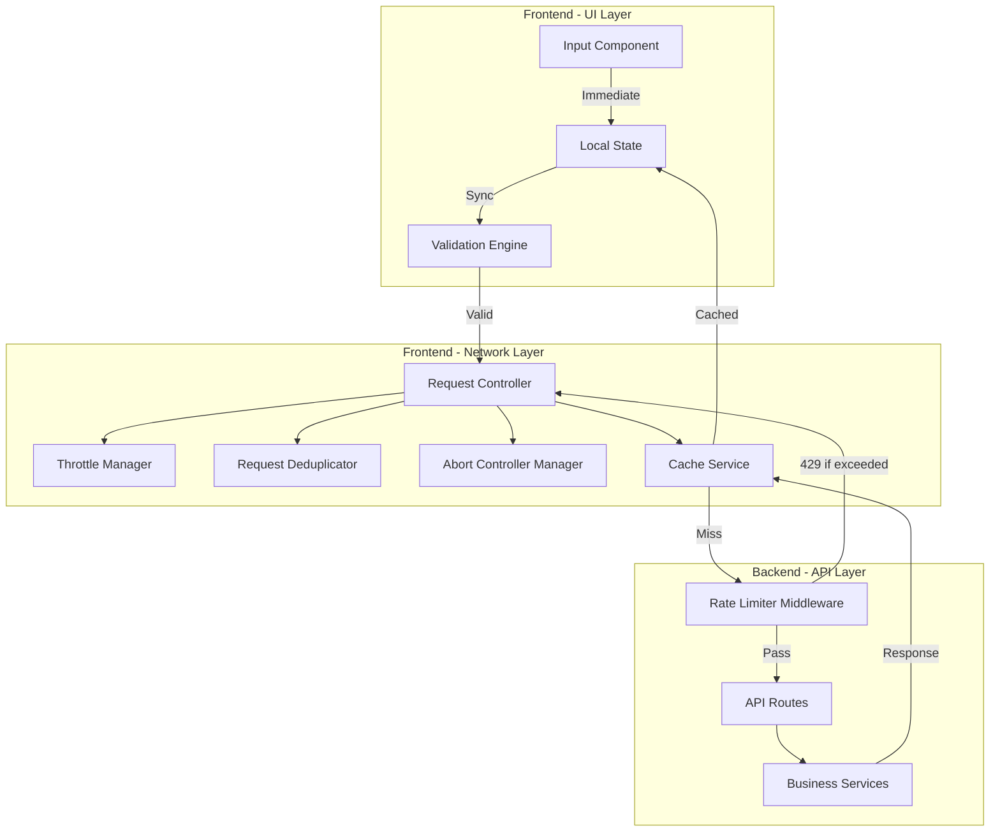

# Design Document: Input Performance Optimization

## Overview

This design implements a modern, layered approach to input handling that eliminates artificial UI delays while providing intelligent network request management and backend protection. The solution separates concerns into three distinct layers:

1. **UI Layer**: Immediate, synchronous updates with no artificial delays
2. **Network Layer**: Intelligent request management with throttling, cancellation, and deduplication
3. **Backend Layer**: Independent rate limiting and protection

The design follows the principle that UI responsiveness and network efficiency are separate concerns that should be handled independently. By removing debounce from the UI layer and applying throttling only at the network boundary, we achieve both immediate user feedback and efficient resource utilization.

### Key Design Principles

- **Immediate Feedback**: UI updates synchronously within the 16ms frame budget
- **Separation of Concerns**: UI, validation, and network layers are independent
- **Progressive Enhancement**: Backward compatible with gradual migration path
- **Defense in Depth**: Multiple layers of protection (client throttling + server rate limiting)
- **Testability**: All components designed for comprehensive testing

## Architecture

### System Architecture Diagram



### Layer Responsibilities

**UI Layer (0-16ms response time)**
- Capture user input events
- Update local state immediately
- Perform synchronous validation
- Display validation errors
- Show loading states

**Network Layer (300ms throttle window)**
- Throttle requests per endpoint
- Cancel outdated requests
- Deduplicate simultaneous requests
- Manage cache lifecycle
- Handle network errors

**Backend Layer (Independent protection)**
- Enforce rate limits per IP/endpoint
- Log violations
- Return 429 with Retry-After
- Process valid requests
- Return responses

## Components and Interfaces

### 1. Input Handler Component

**Purpose**: Capture user input and update UI state immediately

**Interface**:
```typescript
interface InputHandlerProps {
  value: string;
  onChange: (value: string) => void;
  onValidate?: (value: string) => ValidationResult;
  onSearch?: (value: string) => Promise<void>;
  placeholder?: string;
  'data-testid'?: string;
}

interface ValidationResult {
  isValid: boolean;
  errors?: string[];
}
```

**Behavior**:
- Updates local state on every keystroke (no debounce)
- Calls validation synchronously
- Triggers network request only if validation passes
- Displays validation errors immediately

### 2. Validation Engine

**Purpose**: Perform synchronous input validation before network calls

**Interface**:
```typescript
interface ValidationEngine {
  validate(input: string, rules: ValidationRule[]): ValidationResult;
  addRule(rule: ValidationRule): void;
  removeRule(ruleId: string): void;
}

interface ValidationRule {
  id: string;
  validate: (input: string) => boolean;
  errorMessage: string;
}

interface ValidationResult {
  isValid: boolean;
  errors: string[];
  validatedValue: string;
}
```

**Built-in Rules**:
- Minimum/maximum length
- Pattern matching (regex)
- Required field
- Custom business rules

### 3. Request Controller

**Purpose**: Manage network request lifecycle with throttling and cancellation

**Interface**:
```typescript
interface RequestController {
  request<T>(
    key: string,
    requestFn: (signal: AbortSignal) => Promise<T>,
    options?: RequestOptions
  ): Promise<T>;
  
  cancelPending(key: string): void;
  clearCache(key?: string): void;
}

interface RequestOptions {
  throttleMs?: number;
  cacheMs?: number;
  deduplicate?: boolean;
}
```

**Behavior**:
- Throttles requests per key (default 300ms)
- Cancels pending requests when new request arrives
- Deduplicates simultaneous identical requests
- Integrates with cache service
- Provides AbortSignal to request functions

### 4. Throttle Manager

**Purpose**: Limit request frequency per endpoint

**Interface**:
```typescript
interface ThrottleManager {
  throttle<T>(
    key: string,
    fn: () => Promise<T>,
    waitMs: number
  ): Promise<T>;
  
  cancel(key: string): void;
  isThrottled(key: string): boolean;
}
```

**Implementation Strategy**:
- Tracks last execution time per key
- Queues requests during throttle window
- Executes only the latest queued request
- Cancels intermediate requests

### 5. Request Deduplicator

**Purpose**: Prevent duplicate simultaneous requests

**Interface**:
```typescript
interface RequestDeduplicator {
  deduplicate<T>(
    key: string,
    requestFn: () => Promise<T>
  ): Promise<T>;
  
  clear(key?: string): void;
}
```

**Behavior**:
- Maintains map of active requests by key
- Returns existing Promise if request is in flight
- Cleans up completed requests
- Shares results across duplicate callers

### 6. Abort Controller Manager

**Purpose**: Manage request cancellation lifecycle

**Interface**:
```typescript
interface AbortControllerManager {
  create(key: string): AbortSignal;
  abort(key: string): void;
  abortAll(): void;
  isAborted(key: string): boolean;
}
```

**Behavior**:
- Creates AbortController per request key
- Aborts previous controller when new request starts
- Cleans up aborted controllers
- Provides signal to fetch calls

### 7. Cache Service

**Purpose**: Store and retrieve frequently accessed data

**Interface**:
```typescript
interface CacheService {
  get<T>(key: string): T | null;
  set<T>(key: string, value: T, ttlMs?: number): void;
  delete(key: string): void;
  clear(): void;
  has(key: string): boolean;
  size(): number;
}

interface CacheEntry<T> {
  data: T;
  expiry: number;
  accessCount: number;
  lastAccess: number;
}
```

**Eviction Strategy**:
- TTL-based expiration (default 5 minutes)
- Size-based eviction (max 1000 entries)
- LRU eviction when size limit reached
- Automatic cleanup of expired entries

### 8. Rate Limiter Middleware (Backend)

**Purpose**: Enforce request rate limits at the API level

**Interface**:
```typescript
interface RateLimiterConfig {
  windowMs: number;
  maxRequests: number;
  keyGenerator?: (req: Request) => string;
  handler?: (req: Request, res: Response) => void;
}

interface RateLimiter {
  middleware(config: RateLimiterConfig): RequestHandler;
  reset(key: string): void;
  getStats(key: string): RateLimitStats;
}

interface RateLimitStats {
  requests: number;
  remaining: number;
  resetTime: number;
}
```

**Behavior**:
- Tracks requests per IP per endpoint
- Returns 429 when limit exceeded
- Includes Retry-After header
- Logs violations
- Configurable per route

## Data Models

### Request State

```typescript
interface RequestState {
  key: string;
  status: 'idle' | 'pending' | 'success' | 'error' | 'cancelled';
  startTime: number;
  endTime?: number;
  error?: Error;
  abortController?: AbortController;
}
```

### Cache Entry

```typescript
interface CacheEntry<T> {
  key: string;
  data: T;
  createdAt: number;
  expiresAt: number;
  accessCount: number;
  lastAccessAt: number;
  size: number;
}
```

### Rate Limit Entry

```typescript
interface RateLimitEntry {
  key: string;
  requests: number[];
  windowStart: number;
  windowEnd: number;
  blocked: boolean;
}
```

### Validation State

```typescript
interface ValidationState {
  input: string;
  isValid: boolean;
  errors: string[];
  validatedAt: number;
  rules: ValidationRule[];
}
```

## Correctness Properties

*A property is a characteristic or behavior that should hold true across all valid executions of a system—essentially, a formal statement about what the system should do. Properties serve as the bridge between human-readable specifications and machine-verifiable correctness guarantees.*


### Property 1: UI Updates Within Frame Budget

*For any* user input event, the UI state update should complete within 16ms (one frame at 60 FPS), ensuring immediate visual feedback without artificial delays.

**Validates: Requirements 1.1, 1.2, 1.5**

### Property 2: Validation Precedes Network Calls

*For any* input value, validation must complete synchronously before any network request is initiated, and invalid inputs must not trigger network calls while valid inputs must proceed to the network layer.

**Validates: Requirements 2.1, 2.2, 2.3, 2.4**

### Property 3: Validation Rule Updates Are Local

*For any* change to validation rules, the new rules should be applied immediately to subsequent validations without requiring network calls or system restarts.

**Validates: Requirements 2.5**

### Property 4: Request Throttling Per Endpoint

*For any* sequence of requests to the same endpoint within a 300ms window, only the last request should be executed, with all intermediate requests being cancelled or skipped.

**Validates: Requirements 3.1**

### Property 5: Request Cancellation and Cleanup

*For any* pending request, when a new request to the same endpoint is initiated, the previous request should be cancelled via AbortController and all associated resources should be cleaned up without processing the cancelled response.

**Validates: Requirements 3.2, 3.5**

### Property 6: Request Deduplication

*For any* set of identical simultaneous requests, all callers should receive the same Promise instance, and only one actual network request should be made.

**Validates: Requirements 3.3**

### Property 7: Throttling Applies Only to Network Layer

*For any* user input that triggers both UI updates and network requests, the UI updates should occur immediately while network requests should be throttled independently.

**Validates: Requirements 3.4**

### Property 8: Rate Limiting Returns 429

*For any* client that exceeds the configured rate limit for an endpoint, the server should respond with HTTP 429 status code and include a Retry-After header indicating when the client can retry.

**Validates: Requirements 4.1, 4.3**

### Property 9: Rate Limiting Per IP Per Endpoint

*For any* two different IP addresses making requests to the same endpoint, their rate limits should be tracked independently, and one IP exceeding its limit should not affect the other.

**Validates: Requirements 4.2**

### Property 10: Configurable Rate Limits Per Endpoint

*For any* two different endpoints with different configured rate limits, requests to each endpoint should be limited according to their specific configuration independently.

**Validates: Requirements 4.4**

### Property 11: Rate Limit Violations Are Logged

*For any* request that exceeds the rate limit, the system should log the violation including the client IP address, endpoint, and timestamp.

**Validates: Requirements 4.5**

### Property 12: Cache Storage with TTL

*For any* successful data fetch, the result should be stored in cache with the configured TTL, and subsequent requests for the same data before expiration should return the cached value without making a network request.

**Validates: Requirements 5.1, 5.2**

### Property 13: Cache Expiration and Refresh

*For any* cached data that has exceeded its TTL, the cache should remove the expired entry and allow fresh network requests to fetch updated data.

**Validates: Requirements 5.3**

### Property 14: Cache Size Limiting with LRU Eviction

*For any* cache that reaches its maximum size limit, the system should evict expired entries first, and if no expired entries exist, evict the least recently used entry to make room for new data.

**Validates: Requirements 5.4, 5.5**

### Property 15: Backward Compatible Interface

*For any* existing component using the old HTTP service interface, the new Request_Controller should provide the same method signatures and behavior, allowing old and new implementations to coexist during migration.

**Validates: Requirements 6.1, 6.2, 6.3, 6.4**

### Property 16: Request Logging with Metrics

*For any* network request, the system should log the request duration, status code, endpoint, and timestamp for monitoring and debugging purposes.

**Validates: Requirements 9.1**

### Property 17: Cache Metrics Tracking

*For any* cache operation (get, set, delete), the system should update hit/miss rate metrics that can be queried for monitoring cache effectiveness.

**Validates: Requirements 9.3**

### Property 18: Performance Metrics Exposure

*For any* monitoring tool or dashboard, the system should expose performance metrics (request duration, cache hit rate, rate limit violations) through a queryable interface.

**Validates: Requirements 9.4**

### Property 19: Performance Degradation Warnings

*For any* request that exceeds performance thresholds (e.g., > 1000ms response time), the system should log a warning with actionable context including endpoint, duration, and potential causes.

**Validates: Requirements 9.5**

### Property 20: Accessibility ARIA Attributes

*For any* UI state change (validation error, loading state, error state), the system should set appropriate ARIA attributes to ensure screen reader accessibility.

**Validates: Requirements 10.1, 10.2**

### Property 21: Keyboard Navigation Preservation

*For any* input field interaction, keyboard navigation (Tab, Shift+Tab, Enter, Escape) and focus management should work correctly without interference from the performance optimizations.

**Validates: Requirements 10.3**

### Property 22: Test ID Preservation

*For any* existing component with data-testid attributes, the performance optimizations should preserve these attributes to maintain test compatibility.

**Validates: Requirements 10.5**

## Error Handling

### Error Categories

**1. Validation Errors**
- Thrown synchronously before network calls
- Displayed immediately in UI
- Do not trigger network requests
- Include field-specific error messages

**2. Network Errors**
- Thrown by fetch failures (network down, timeout, etc.)
- Handled by Request Controller
- Retry logic with exponential backoff
- User-friendly error messages

**3. Rate Limit Errors (429)**
- Returned by backend when limit exceeded
- Include Retry-After header
- Frontend respects Retry-After before retrying
- Logged for monitoring

**4. Cancellation Errors**
- Thrown when AbortController cancels request
- Not treated as failures
- Cleaned up silently
- Not logged as errors

**5. Cache Errors**
- Thrown on cache operations (rare)
- Fall back to network request
- Logged for debugging
- Do not block user operations

### Error Handling Strategy

```typescript
// Validation Error - Synchronous
try {
  const result = validationEngine.validate(input, rules);
  if (!result.isValid) {
    throw new ValidationError(result.errors);
  }
} catch (error) {
  if (error instanceof ValidationError) {
    displayValidationErrors(error.errors);
    return; // Stop here, no network call
  }
}

// Network Error - Asynchronous
try {
  const data = await requestController.request(key, fetchFn);
  return data;
} catch (error) {
  if (error.name === 'AbortError') {
    // Request was cancelled, ignore
    return;
  }
  
  if (error instanceof NetworkError && error.status === 429) {
    const retryAfter = error.headers['retry-after'];
    scheduleRetry(retryAfter);
    displayRateLimitMessage(retryAfter);
    return;
  }
  
  if (error instanceof NetworkError) {
    logger.error('Network request failed', { error, key });
    displayNetworkError(error.message);
    return;
  }
  
  // Unexpected error
  logger.error('Unexpected error', { error, key });
  displayGenericError();
}
```

### Error Recovery

**Validation Errors**: User corrects input, validation re-runs automatically

**Network Errors**: Automatic retry with exponential backoff (3 attempts)

**Rate Limit Errors**: Wait for Retry-After duration, then allow retry

**Cancellation**: No recovery needed, new request already in progress

**Cache Errors**: Fall back to network, log for investigation

## Testing Strategy

### Unit Tests (Vitest)

**Components to Test**:
- Validation Engine: All validation rules and combinations
- Request Controller: Throttling, cancellation, deduplication logic
- Throttle Manager: Timing and queuing behavior
- Request Deduplicator: Promise sharing and cleanup
- Abort Controller Manager: Cancellation and cleanup
- Cache Service: Storage, retrieval, expiration, eviction
- Rate Limiter Middleware: Limit enforcement and logging

**Test Approach**:
- Mock timers for throttling tests
- Mock fetch for network tests
- Test edge cases (empty input, rapid requests, cache full)
- Test error conditions (network failure, validation failure)
- Verify no memory leaks (cleanup after operations)

**Coverage Target**: Minimum 80% for all new code

### Property-Based Tests (fast-check)

**Properties to Test**:
- Property 1: UI timing (measure actual update time)
- Property 4: Throttling (generate rapid requests, verify only 1 per window)
- Property 6: Deduplication (generate identical requests, verify single Promise)
- Property 12: Cache behavior (generate random cache operations, verify correctness)
- Property 14: LRU eviction (fill cache, verify eviction order)

**Configuration**:
- Minimum 100 iterations per property test
- Use custom generators for realistic test data
- Tag each test with property number and description

**Example Property Test**:
```typescript
// Property 4: Request Throttling Per Endpoint
it('should throttle requests to max 1 per 300ms per endpoint', async () => {
  await fc.assert(
    fc.asyncProperty(
      fc.array(fc.string(), { minLength: 5, maxLength: 20 }), // Generate rapid requests
      async (requests) => {
        const startTime = Date.now();
        const results = await Promise.all(
          requests.map(req => requestController.request(`endpoint-${req}`, mockFetch))
        );
        const endTime = Date.now();
        
        // Verify throttling: should take at least (requests.length - 1) * 300ms
        const expectedMinTime = (requests.length - 1) * 300;
        expect(endTime - startTime).toBeGreaterThanOrEqual(expectedMinTime);
        
        // Verify all requests completed
        expect(results).toHaveLength(requests.length);
      }
    ),
    { numRuns: 100 }
  );
});
```

### Integration Tests (Vitest + Testcontainers)

**Scenarios to Test**:
- Full flow: User input → Validation → Network → Cache → UI update
- Rate limiting: Frontend throttling + Backend rate limiting working together
- Cache integration: Cache hit/miss with real network calls
- Error handling: Network failures, validation failures, rate limit errors
- Migration: Old and new patterns coexisting

**Test Environment**:
- Use Testcontainers for backend services
- Mock external APIs
- Test with realistic data volumes
- Verify performance characteristics

### E2E Tests (Cypress)

**User Scenarios**:
1. User types in search field, sees immediate feedback
2. User types rapidly, only last search executes
3. User triggers rate limit, sees appropriate message
4. User gets cached results on repeated searches
5. User experiences network error, sees retry behavior

**Test Implementation**:
```typescript
describe('Input Performance E2E', () => {
  beforeEach(() => {
    cy.login(TEST_USERS.ADMIN.email, TEST_USERS.ADMIN.password);
  });

  it('should provide immediate UI feedback on input', () => {
    cy.visit('/search');
    
    const testInput = 'test search query';
    cy.get('[data-testid="search-input"]').type(testInput);
    
    // Verify immediate UI update (no debounce delay)
    cy.get('[data-testid="search-input"]').should('have.value', testInput);
    
    // Verify loading indicator appears
    cy.get('[data-testid="loading-indicator"]').should('be.visible');
    
    // Verify results appear
    cy.get('[data-testid="search-results"]').should('be.visible');
  });

  it('should throttle rapid requests', () => {
    cy.visit('/search');
    
    // Type rapidly
    cy.get('[data-testid="search-input"]').type('a{backspace}b{backspace}c{backspace}d');
    
    // Intercept network requests
    cy.intercept('GET', '/api/search*').as('searchRequest');
    
    // Wait for throttle window
    cy.wait(400);
    
    // Verify only one request was made (for 'd')
    cy.get('@searchRequest.all').should('have.length', 1);
    cy.get('@searchRequest').its('request.url').should('include', 'query=d');
  });

  it('should handle rate limiting gracefully', () => {
    cy.visit('/search');
    
    // Trigger many requests to exceed rate limit
    for (let i = 0; i < 150; i++) {
      cy.get('[data-testid="search-input"]').clear().type(`query${i}`);
      cy.wait(50);
    }
    
    // Verify rate limit message appears
    cy.get('[data-testid="rate-limit-message"]').should('be.visible');
    cy.get('[data-testid="rate-limit-message"]').should('contain', 'Too many requests');
  });
});
```

### Performance Tests

**Metrics to Measure**:
- UI update time: < 16ms (1 frame)
- Network request throttling: 1 per 300ms per endpoint
- Cache hit rate: > 80% for repeated queries
- Memory usage: Stable over time (no leaks)
- Backend response time: < 200ms (95th percentile)

**Test Tools**:
- Chrome DevTools Performance profiler
- Lighthouse for overall performance
- Custom timing measurements in tests
- Backend performance monitoring

### Test Organization

```
src/__tests__/
├── unit/
│   ├── frontend/
│   │   ├── services/
│   │   │   ├── validation-engine.test.ts
│   │   │   ├── request-controller.test.ts
│   │   │   ├── throttle-manager.test.ts
│   │   │   ├── request-deduplicator.test.ts
│   │   │   ├── abort-controller-manager.test.ts
│   │   │   └── cache-service.test.ts
│   │   └── components/
│   │       └── input-handler.test.tsx
│   └── backend/
│       └── middleware/
│           └── rate-limiter.test.ts
├── integration/
│   ├── frontend/
│   │   └── input-flow.integration.test.ts
│   └── backend/
│       └── rate-limiting.integration.test.ts
└── property/
    ├── throttling.property.test.ts
    ├── deduplication.property.test.ts
    ├── cache-behavior.property.test.ts
    └── lru-eviction.property.test.ts

src/e2e/
├── input-performance/
│   ├── immediate-feedback.cy.ts
│   ├── request-throttling.cy.ts
│   ├── rate-limiting.cy.ts
│   └── cache-behavior.cy.ts
└── fixtures/
    └── test-data.ts
```

### Test Data and Fixtures

**Validation Test Data**:
- Valid inputs: Various lengths, formats, special characters
- Invalid inputs: Empty, too short, too long, invalid format
- Edge cases: Boundary values, unicode, emojis

**Network Test Data**:
- Successful responses: Various data sizes
- Error responses: 400, 429, 500, network timeout
- Slow responses: Simulate latency

**Cache Test Data**:
- Small entries: < 1KB
- Large entries: > 100KB
- Many entries: Test eviction

## Implementation Notes

### Migration Strategy

**Phase 1: Infrastructure (Week 1)**
- Implement core services (Validation Engine, Request Controller, Cache Service)
- Add unit tests for all services
- No changes to existing components

**Phase 2: Backend Protection (Week 1)**
- Implement Rate Limiter middleware
- Add to critical endpoints
- Monitor rate limit violations

**Phase 3: Pilot Migration (Week 2)**
- Migrate one search component to new pattern
- Add E2E tests for migrated component
- Monitor performance metrics
- Gather feedback

**Phase 4: Gradual Rollout (Weeks 3-4)**
- Migrate remaining search/filter components
- Update documentation
- Train team on new patterns

**Phase 5: Cleanup (Week 5)**
- Remove old debounce utilities
- Update all documentation
- Final performance audit

### Performance Monitoring

**Metrics to Track**:
- UI update latency (p50, p95, p99)
- Network request rate per endpoint
- Cache hit/miss rates
- Rate limit violations per IP
- Memory usage over time

**Alerting Thresholds**:
- UI update > 50ms: Warning
- Cache hit rate < 70%: Warning
- Rate limit violations > 100/hour: Alert
- Memory growth > 10MB/hour: Alert

### Rollback Plan

**If Issues Arise**:
1. Feature flag to disable new pattern per component
2. Revert to old debounce pattern
3. Investigate and fix issues
4. Re-enable gradually

**Rollback Triggers**:
- User-reported UI lag
- Increased error rates
- Memory leaks detected
- Performance degradation

