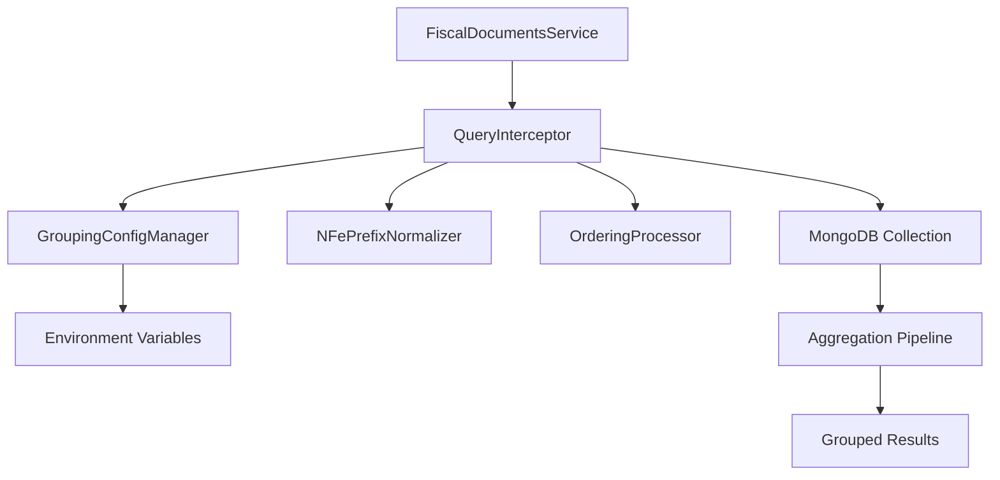
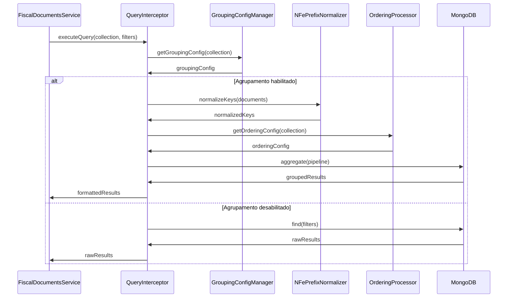

# Documento de Design - Sistema de Agrupamento Configurável de NFe

## Visão Geral

O sistema de agrupamento configurável de NFe implementa uma camada de interceptação transparente que modifica consultas MongoDB para aplicar agrupamento baseado em configurações de variáveis de ambiente. A solução mantém total compatibilidade com o código existente enquanto adiciona funcionalidade avançada de agrupamento e ordenação.

### Arquitetura de Alto Nível



## Arquitetura

### Componentes Principais

#### 1. GroupingConfigManager
Responsável por gerenciar configurações de agrupamento através de variáveis de ambiente.

**Responsabilidades:**
- Ler e validar variáveis de ambiente de configuração
- Fornecer configurações padrão quando necessário
- Detectar mudanças em configurações em tempo de execução
- Validar chaves de agrupamento contra schema da coleção

#### 2. NFePrefixNormalizer
Processa chaves CHV_NFE para normalizar prefixos "NFe".

**Responsabilidades:**
- Detectar e remover prefixos "NFe" de chaves de acesso
- Manter mapeamento entre chaves originais e normalizadas
- Preservar formato original para exibição
- Otimizar operações de normalização para performance

#### 3. QueryInterceptor
Intercepta consultas MongoDB e aplica transformações de agrupamento.

**Responsabilidades:**
- Interceptar consultas para coleção tbl_nfe_100
- Construir pipelines de agregação MongoDB
- Aplicar filtros e condições da consulta original
- Transformar resultados para formato esperado pelo cliente

#### 4. OrderingProcessor
Processa configurações de ordenação e aplica aos resultados.

**Responsabilidades:**
- Parsear configurações de ordenação de variáveis de ambiente
- Validar campos de ordenação contra schema
- Aplicar ordenação em grupos e documentos individuais
- Otimizar ordenação para performance

### Fluxo de Dados



## Componentes e Interfaces

### GroupingConfigManager

```typescript
interface GroupingConfig {
  enabled: boolean;
  groupByFields: string[];
  collection: string;
  globalEnabled: boolean;
}

interface OrderingConfig {
  fields: Array<{
    field: string;
    direction: 'ASC' | 'DESC';
  }>;
  defaultOrdering: string;
}

class GroupingConfigManager {
  private configCache: Map<string, GroupingConfig>;
  private lastConfigCheck: number;
  private readonly CONFIG_CACHE_TTL = 60000; // 1 minuto

  getGroupingConfig(collection: string): GroupingConfig;
  getOrderingConfig(collection: string): OrderingConfig;
  isGloballyEnabled(): boolean;
  validateGroupingFields(fields: string[], collection: string): boolean;
  refreshConfig(): void;
}
```

### NFePrefixNormalizer

```typescript
interface NormalizationResult {
  originalKey: string;
  normalizedKey: string;
  hadPrefix: boolean;
}

class NFePrefixNormalizer {
  private readonly NFE_PREFIX = 'NFe';
  private readonly PREFIX_LENGTH = 3;

  normalizeKey(key: string): NormalizationResult;
  normalizeBatch(keys: string[]): Map<string, NormalizationResult>;
  shouldNormalize(field: string): boolean;
  createNormalizationPipeline(): any[];
}
```

### QueryInterceptor

```typescript
interface InterceptionContext {
  collection: string;
  originalQuery: any;
  groupingConfig: GroupingConfig;
  orderingConfig: OrderingConfig;
}

interface InterceptionResult {
  success: boolean;
  data: any[];
  metadata: {
    grouped: boolean;
    groupCount: number;
    totalDocuments: number;
    processingTime: number;
  };
}

class QueryInterceptor {
  private groupingManager: GroupingConfigManager;
  private prefixNormalizer: NFePrefixNormalizer;
  private orderingProcessor: OrderingProcessor;

  intercept(collection: string, query: any, options?: any): Promise<InterceptionResult>;
  buildAggregationPipeline(context: InterceptionContext): any[];
  transformResults(results: any[], context: InterceptionContext): any[];
  shouldIntercept(collection: string): boolean;
}
```

### OrderingProcessor

```typescript
interface OrderingField {
  field: string;
  direction: 1 | -1; // MongoDB sort direction
  priority: number;
}

class OrderingProcessor {
  private readonly DEFAULT_ORDERING = 'DT_DOC DESC, PROTOCOLADA DESC';

  parseOrderingConfig(config: string): OrderingField[];
  buildSortStage(fields: OrderingField[]): any;
  validateOrderingFields(fields: string[], collection: string): boolean;
  applyGroupOrdering(pipeline: any[], ordering: OrderingField[]): void;
}
```

## Modelos de Dados

### Configuração de Ambiente

```typescript
interface EnvironmentConfig {
  // Configuração global
  NFE_GROUPING_ENABLED: boolean;
  
  // Configuração específica da coleção tbl_nfe_100
  TBL_NFE_100_GROUP_BY: string; // 'CHV_NFE' ou múltiplas chaves separadas por vírgula
  TBL_NFE_100_ORDER_BY: string; // 'DT_DOC DESC, PROTOCOLADA DESC'
  TBL_NFE_100_GROUPING_ENABLED: boolean;
  
  // Configurações de performance
  NFE_GROUPING_CACHE_TTL: number; // TTL do cache em segundos
  NFE_GROUPING_MAX_GROUPS: number; // Limite máximo de grupos
}
```

### Estrutura de Documento NFe

```typescript
interface NFEDocument {
  _id: string;
  CHV_NFE: string; // Chave de acesso (pode ter prefixo "NFe")
  DT_DOC: Date; // Data do documento
  PROTOCOLADA: boolean; // Status de protocolação
  VALOR_TOTAL: number;
  CNPJ_EMIT: string;
  NOME_EMIT: string;
  // ... outros campos
}
```

### Resultado Agrupado

```typescript
interface GroupedNFEResult {
  _id: {
    CHV_NFE_NORMALIZED: string; // Chave normalizada (sem prefixo)
    // ... outras chaves de agrupamento
  };
  documents: NFEDocument[]; // Documentos do grupo
  count: number; // Quantidade de documentos no grupo
  totalValue: number; // Valor total do grupo
  latestDocument: NFEDocument; // Documento mais recente do grupo
  metadata: {
    hasNFePrefix: boolean; // Se algum documento tinha prefixo
    originalKeys: string[]; // Chaves originais antes da normalização
  };
}
```

## Implementação Detalhada

### 1. Interceptação de Consultas

```typescript
// apps/backend/src/services/QueryInterceptor.ts
export class QueryInterceptor {
  async intercept(collection: string, query: any, options: any = {}): Promise<InterceptionResult> {
    const startTime = Date.now();
    
    // Verificar se deve interceptar esta coleção
    if (!this.shouldIntercept(collection)) {
      return this.executeOriginalQuery(collection, query, options);
    }
    
    // Obter configurações
    const groupingConfig = await this.groupingManager.getGroupingConfig(collection);
    const orderingConfig = await this.groupingManager.getOrderingConfig(collection);
    
    // Verificar se agrupamento está habilitado
    if (!groupingConfig.enabled || !groupingConfig.globalEnabled) {
      return this.executeOriginalQuery(collection, query, options);
    }
    
    // Construir contexto de interceptação
    const context: InterceptionContext = {
      collection,
      originalQuery: query,
      groupingConfig,
      orderingConfig
    };
    
    // Construir pipeline de agregação
    const pipeline = this.buildAggregationPipeline(context);
    
    // Executar agregação
    const results = await this.executeAggregation(collection, pipeline);
    
    // Transformar resultados
    const transformedResults = this.transformResults(results, context);
    
    const processingTime = Date.now() - startTime;
    
    return {
      success: true,
      data: transformedResults,
      metadata: {
        grouped: true,
        groupCount: results.length,
        totalDocuments: transformedResults.reduce((sum, group) => sum + group.count, 0),
        processingTime
      }
    };
  }
  
  private buildAggregationPipeline(context: InterceptionContext): any[] {
    const pipeline: any[] = [];
    
    // 1. Aplicar filtros da consulta original
    if (Object.keys(context.originalQuery).length > 0) {
      pipeline.push({ $match: context.originalQuery });
    }
    
    // 2. Normalizar chaves CHV_NFE se necessário
    if (context.groupingConfig.groupByFields.includes('CHV_NFE')) {
      pipeline.push(...this.prefixNormalizer.createNormalizationPipeline());
    }
    
    // 3. Agrupar documentos
    const groupStage = this.buildGroupStage(context.groupingConfig);
    pipeline.push(groupStage);
    
    // 4. Aplicar ordenação
    const sortStage = this.orderingProcessor.buildSortStage(
      this.orderingProcessor.parseOrderingConfig(context.orderingConfig.defaultOrdering)
    );
    pipeline.push(sortStage);
    
    return pipeline;
  }
  
  private buildGroupStage(config: GroupingConfig): any {
    const groupId: any = {};
    
    // Construir _id do grupo baseado nos campos de agrupamento
    config.groupByFields.forEach(field => {
      if (field === 'CHV_NFE') {
        groupId.CHV_NFE_NORMALIZED = '$CHV_NFE_NORMALIZED';
      } else {
        groupId[field] = `$${field}`;
      }
    });
    
    return {
      $group: {
        _id: groupId,
        documents: { $push: '$$ROOT' },
        count: { $sum: 1 },
        totalValue: { $sum: '$VALOR_TOTAL' },
        latestDocument: { $last: '$$ROOT' },
        originalKeys: { $addToSet: '$CHV_NFE' },
        hasNFePrefix: {
          $max: {
            $cond: [
              { $eq: [{ $substr: ['$CHV_NFE', 0, 3] }, 'NFe'] },
              true,
              false
            ]
          }
        }
      }
    };
  }
}
```

### 2. Normalização de Prefixos

```typescript
// apps/backend/src/utils/NFePrefixNormalizer.ts
export class NFePrefixNormalizer {
  normalizeKey(key: string): NormalizationResult {
    if (!key || typeof key !== 'string') {
      return {
        originalKey: key,
        normalizedKey: key,
        hadPrefix: false
      };
    }
    
    const hasPrefix = key.startsWith(this.NFE_PREFIX);
    const normalizedKey = hasPrefix 
      ? key.substring(this.PREFIX_LENGTH)
      : key;
    
    return {
      originalKey: key,
      normalizedKey,
      hadPrefix: hasPrefix
    };
  }
  
  createNormalizationPipeline(): any[] {
    return [
      {
        $addFields: {
          CHV_NFE_NORMALIZED: {
            $cond: [
              { $eq: [{ $substr: ['$CHV_NFE', 0, 3] }, 'NFe'] },
              { $substr: ['$CHV_NFE', 3, -1] },
              '$CHV_NFE'
            ]
          }
        }
      }
    ];
  }
  
  normalizeBatch(keys: string[]): Map<string, NormalizationResult> {
    const results = new Map<string, NormalizationResult>();
    
    keys.forEach(key => {
      results.set(key, this.normalizeKey(key));
    });
    
    return results;
  }
}
```

### 3. Gerenciamento de Configuração

```typescript
// apps/backend/src/services/GroupingConfigManager.ts
export class GroupingConfigManager {
  private configCache = new Map<string, GroupingConfig>();
  private lastConfigCheck = 0;
  
  getGroupingConfig(collection: string): GroupingConfig {
    const cacheKey = `grouping_${collection}`;
    const now = Date.now();
    
    // Verificar cache
    if (this.configCache.has(cacheKey) && 
        (now - this.lastConfigCheck) < this.CONFIG_CACHE_TTL) {
      return this.configCache.get(cacheKey)!;
    }
    
    // Carregar configuração do ambiente
    const config = this.loadConfigFromEnvironment(collection);
    
    // Validar configuração
    this.validateConfig(config, collection);
    
    // Atualizar cache
    this.configCache.set(cacheKey, config);
    this.lastConfigCheck = now;
    
    return config;
  }
  
  private loadConfigFromEnvironment(collection: string): GroupingConfig {
    const collectionUpper = collection.toUpperCase();
    const groupByVar = `${collectionUpper}_GROUP_BY`;
    const enabledVar = `${collectionUpper}_GROUPING_ENABLED`;
    
    const groupByValue = process.env[groupByVar] || 'CHV_NFE';
    const enabled = process.env[enabledVar] !== 'false';
    const globalEnabled = process.env.NFE_GROUPING_ENABLED !== 'false';
    
    // Parsear campos de agrupamento
    const groupByFields = groupByValue
      .split(',')
      .map(field => field.trim())
      .filter(field => field.length > 0);
    
    return {
      enabled: enabled && groupByFields.length > 0,
      groupByFields,
      collection,
      globalEnabled
    };
  }
  
  private validateConfig(config: GroupingConfig, collection: string): void {
    // Validar campos de agrupamento contra schema da coleção
    const validFields = this.getValidFieldsForCollection(collection);
    
    config.groupByFields.forEach(field => {
      if (!validFields.includes(field)) {
        logger.warn(`Campo de agrupamento inválido: ${field} para coleção ${collection}`);
      }
    });
  }
  
  private getValidFieldsForCollection(collection: string): string[] {
    // Retornar campos válidos baseado na coleção
    switch (collection) {
      case 'tbl_nfe_100':
        return ['CHV_NFE', 'CNPJ_EMIT', 'DT_DOC', 'PROTOCOLADA'];
      default:
        return [];
    }
  }
}
```

### 4. Integração com FiscalDocumentsService

```typescript
// apps/backend/src/services/FiscalDocumentsService.ts
export class FiscalDocumentsService {
  private queryInterceptor: QueryInterceptor;
  
  constructor() {
    this.queryInterceptor = new QueryInterceptor();
  }
  
  async getDocuments(filters: any, options: any = {}): Promise<any> {
    try {
      // Interceptar consulta se configurado
      const result = await this.queryInterceptor.intercept(
        'tbl_nfe_100',
        filters,
        options
      );
      
      // Log de performance se agrupamento foi aplicado
      if (result.metadata.grouped) {
        logger.info('Consulta agrupada executada', {
          collection: 'tbl_nfe_100',
          groupCount: result.metadata.groupCount,
          totalDocuments: result.metadata.totalDocuments,
          processingTime: result.metadata.processingTime
        });
      }
      
      return result.data;
    } catch (error) {
      logger.error('Erro ao executar consulta com agrupamento', {
        error: error.message,
        filters,
        options
      });
      throw error;
    }
  }
}
```

## Tratamento de Erros

### Estratégia de Fallback

```typescript
class QueryInterceptor {
  async intercept(collection: string, query: any, options: any = {}): Promise<InterceptionResult> {
    try {
      // Tentar executar com agrupamento
      return await this.executeWithGrouping(collection, query, options);
    } catch (error) {
      logger.error('Erro durante agrupamento, executando consulta original', {
        error: error.message,
        collection,
        query
      });
      
      // Fallback para consulta original
      return await this.executeOriginalQuery(collection, query, options);
    }
  }
  
  private async executeOriginalQuery(collection: string, query: any, options: any): Promise<InterceptionResult> {
    const startTime = Date.now();
    const results = await this.mongoClient.collection(collection).find(query, options).toArray();
    
    return {
      success: true,
      data: results,
      metadata: {
        grouped: false,
        groupCount: 0,
        totalDocuments: results.length,
        processingTime: Date.now() - startTime
      }
    };
  }
}
```

### Validação de Configuração

```typescript
class GroupingConfigManager {
  validateConfig(config: GroupingConfig, collection: string): void {
    const errors: string[] = [];
    
    // Validar campos de agrupamento
    if (config.groupByFields.length === 0) {
      errors.push('Nenhum campo de agrupamento especificado');
    }
    
    // Validar campos contra schema
    const validFields = this.getValidFieldsForCollection(collection);
    config.groupByFields.forEach(field => {
      if (!validFields.includes(field)) {
        errors.push(`Campo inválido para agrupamento: ${field}`);
      }
    });
    
    if (errors.length > 0) {
      throw new ValidationError('Configuração de agrupamento inválida', {
        errors,
        collection,
        config
      });
    }
  }
}
```

## Estratégia de Testes

### Testes Unitários

**Componentes a testar:**
- GroupingConfigManager: Carregamento e validação de configurações
- NFePrefixNormalizer: Normalização de chaves com e sem prefixo
- OrderingProcessor: Parsing e aplicação de ordenação
- QueryInterceptor: Construção de pipelines e transformação de resultados

**Cenários de teste:**
- Configurações válidas e inválidas
- Chaves com e sem prefixo "NFe"
- Múltiplos campos de agrupamento
- Ordenação em diferentes direções
- Fallback para consulta original em caso de erro

### Testes de Integração

**Cenários a testar:**
- Consultas com agrupamento habilitado e desabilitado
- Performance com grandes volumes de dados
- Compatibilidade com consultas existentes
- Mudanças de configuração em tempo de execução

### Testes de Performance

**Métricas a monitorar:**
- Tempo de resposta com e sem agrupamento
- Uso de memória durante agregação
- Throughput de consultas
- Eficiência de cache de configuração

**Configuração de teste:**
- Dataset com 100k documentos NFe
- Diferentes configurações de agrupamento
- Medição de overhead máximo de 20%

## Propriedades de Correção

*Uma propriedade é uma característica ou comportamento que deve ser verdadeiro em todas as execuções válidas de um sistema - essencialmente, uma declaração formal sobre o que o sistema deve fazer. As propriedades servem como ponte entre especificações legíveis por humanos e garantias de correção verificáveis por máquina.*

### Propriedade 1: Normalização Consistente de Chaves NFe
*Para qualquer* conjunto de chaves CHV_NFE, quando o sistema aplicar normalização de prefixos, chaves idênticas exceto pelo prefixo "NFe" devem ser tratadas como equivalentes, e o formato original deve ser preservado nos resultados
**Valida: Requisitos 2.1, 2.2, 2.3, 2.4, 2.5**

### Propriedade 2: Aplicação Correta de Configurações de Agrupamento
*Para qualquer* configuração válida de agrupamento especificada em variáveis de ambiente, o sistema deve aplicar o agrupamento pelos campos especificados e refletir mudanças de configuração em consultas subsequentes
**Valida: Requisitos 1.1, 1.4, 1.5**

### Propriedade 3: Comportamento Padrão com Configurações Ausentes
*Para qualquer* cenário onde configurações estejam ausentes, vazias ou inválidas, o sistema deve usar valores padrão apropriados ou manter comportamento original sem agrupamento
**Valida: Requisitos 1.3, 3.2**

### Propriedade 4: Ordenação Configurável Completa
*Para qualquer* configuração válida de ordenação, o sistema deve aplicar ordenação em cascata nos campos especificados, com direções corretas (ASC/DESC), tanto em grupos quanto em documentos individuais
**Valida: Requisitos 3.1, 3.3, 3.4, 3.5**

### Propriedade 5: Preservação de Compatibilidade
*Para qualquer* função ou interface existente, o sistema deve manter assinaturas, tipos de retorno e comportamento inalterados quando a funcionalidade de agrupamento estiver desabilitada, garantindo compatibilidade total com código cliente existente
**Valida: Requisitos 4.1, 4.2, 4.3, 4.4, 4.5**

### Propriedade 6: Controle Global e Precedência de Configurações
*Para qualquer* combinação de configurações globais e específicas por coleção, o sistema deve respeitar a hierarquia de precedência (específico > global) e aplicar mudanças dinamicamente sem reinicialização
**Valida: Requisitos 5.1, 5.2, 5.3, 5.4, 5.5**

### Propriedade 7: Interceptação e Preservação de Consultas
*Para qualquer* consulta MongoDB válida na coleção tbl_nfe_100, quando agrupamento estiver configurado, o sistema deve interceptar a consulta, aplicar pipeline de agregação apropriado, e preservar todos os filtros e condições da consulta original
**Valida: Requisitos 6.1, 6.2, 6.3, 6.4**

### Propriedade 8: Validação Robusta de Configurações
*Para qualquer* configuração de agrupamento fornecida, o sistema deve validar cada campo individualmente contra o schema da coleção e rejeitar configurações inválidas com mensagens descritivas
**Valida: Requisitos 7.3**

### Propriedade 9: Logging Estruturado e Completo
*Para qualquer* operação de agrupamento executada, o sistema deve registrar configurações utilizadas, tempos de processamento, quantidades de chaves normalizadas e mudanças de configuração com timestamps apropriados
**Valida: Requisitos 8.1, 8.2, 8.3, 8.5**

### Propriedade 10: Cache Eficiente de Configurações
*Para qualquer* configuração carregada do ambiente, o sistema deve cachear o resultado pelo TTL especificado e reutilizar configurações cached para evitar re-processamento desnecessário
**Valida: Requisitos 9.5**

### Propriedade 11: Isolamento de Configurações por Coleção
*Para qualquer* conjunto de coleções com configurações independentes, mudanças na configuração de uma coleção não devem afetar outras coleções, e coleções sem configuração específica devem usar configuração global padrão
**Valida: Requisitos 10.1, 10.2, 10.3, 10.4, 10.5**

## Tratamento de Erros

### Estratégia de Recuperação Graceful

O sistema implementa uma estratégia de fallback em múltiplas camadas:

1. **Erro de Configuração**: Usar configuração padrão e registrar aviso
2. **Erro de Validação**: Rejeitar configuração inválida com mensagem descritiva
3. **Erro de Agregação**: Executar consulta original sem agrupamento
4. **Erro de Normalização**: Usar chave original sem normalização
5. **Erro de Cache**: Recarregar configuração do ambiente

### Classes de Erro Específicas

```typescript
export class GroupingConfigurationError extends BaseError {
  readonly statusCode = 400;
  readonly errorCode = 'GROUPING_CONFIG_ERROR';
  readonly isOperational = true;
}

export class NFePrefixNormalizationError extends BaseError {
  readonly statusCode = 500;
  readonly errorCode = 'NFE_PREFIX_ERROR';
  readonly isOperational = true;
}

export class QueryInterceptionError extends BaseError {
  readonly statusCode = 500;
  readonly errorCode = 'QUERY_INTERCEPTION_ERROR';
  readonly isOperational = true;
}
```

## Estratégia de Testes

### Abordagem Dual de Testes

**Testes Unitários:**
- Validação de configurações específicas
- Casos extremos e condições de erro
- Exemplos concretos de comportamento esperado
- Integração entre componentes

**Testes Baseados em Propriedades:**
- Verificação de propriedades universais através de entradas aleatórias
- Mínimo 100 iterações por teste de propriedade
- Cobertura abrangente de cenários através de randomização
- Validação de invariantes do sistema

### Configuração de Testes de Propriedade

**Biblioteca:** fast-check para property-based testing
**Configuração mínima:** 100 iterações por teste
**Formato de tag:** **Feature: nfe-configurable-grouping, Property {número}: {texto da propriedade}**

### Exemplos de Testes de Propriedade

```typescript
// Propriedade 1: Normalização Consistente de Chaves NFe
describe('NFe Key Normalization Properties', () => {
  it('should normalize NFe prefixes consistently', async () => {
    await fc.assert(fc.asyncProperty(
      fc.array(fc.string({ minLength: 44, maxLength: 47 })), // Chaves NFe
      async (keys) => {
        // Feature: nfe-configurable-grouping, Property 1: Normalização Consistente de Chaves NFe
        const normalizer = new NFePrefixNormalizer();
        const results = normalizer.normalizeBatch(keys);
        
        // Verificar que chaves idênticas (exceto prefixo) são tratadas como equivalentes
        const normalizedKeys = Array.from(results.values()).map(r => r.normalizedKey);
        const uniqueNormalized = new Set(normalizedKeys);
        
        // Se duas chaves originais diferem apenas pelo prefixo, devem ter mesma chave normalizada
        for (let i = 0; i < keys.length; i++) {
          for (let j = i + 1; j < keys.length; j++) {
            const key1 = keys[i];
            const key2 = keys[j];
            
            if (key1.startsWith('NFe') && key2 === key1.substring(3)) {
              expect(results.get(key1)?.normalizedKey).toBe(results.get(key2)?.normalizedKey);
            }
          }
        }
        
        // Formato original deve ser preservado
        results.forEach((result, originalKey) => {
          expect(result.originalKey).toBe(originalKey);
        });
      }
    ), { numRuns: 100 });
  });
});

// Propriedade 2: Aplicação Correta de Configurações de Agrupamento
describe('Grouping Configuration Properties', () => {
  it('should apply grouping configurations correctly', async () => {
    await fc.assert(fc.asyncProperty(
      fc.array(fc.constantFrom('CHV_NFE', 'CNPJ_EMIT', 'DT_DOC'), { minLength: 1, maxLength: 3 }),
      async (groupByFields) => {
        // Feature: nfe-configurable-grouping, Property 2: Aplicação Correta de Configurações de Agrupamento
        const configManager = new GroupingConfigManager();
        
        // Simular configuração de ambiente
        process.env.TBL_NFE_100_GROUP_BY = groupByFields.join(',');
        
        const config = configManager.getGroupingConfig('tbl_nfe_100');
        
        expect(config.groupByFields).toEqual(groupByFields);
        expect(config.enabled).toBe(true);
        
        // Mudança de configuração deve ser refletida
        const newFields = ['CHV_NFE'];
        process.env.TBL_NFE_100_GROUP_BY = newFields.join(',');
        configManager.refreshConfig();
        
        const newConfig = configManager.getGroupingConfig('tbl_nfe_100');
        expect(newConfig.groupByFields).toEqual(newFields);
      }
    ), { numRuns: 100 });
  });
});
```

### Testes de Integração

**Cenários críticos:**
- Consultas reais com agrupamento habilitado/desabilitado
- Performance com datasets grandes (>10k documentos)
- Mudanças de configuração em tempo de execução
- Compatibilidade com consultas existentes do FiscalDocumentsService

### Métricas de Qualidade

**Cobertura de testes:** Mínimo 90% para componentes críticos
**Performance:** Overhead máximo de 20% com agrupamento habilitado
**Compatibilidade:** 100% das funções existentes devem continuar funcionando
**Confiabilidade:** Fallback para consulta original em caso de erro deve funcionar em 100% dos casos