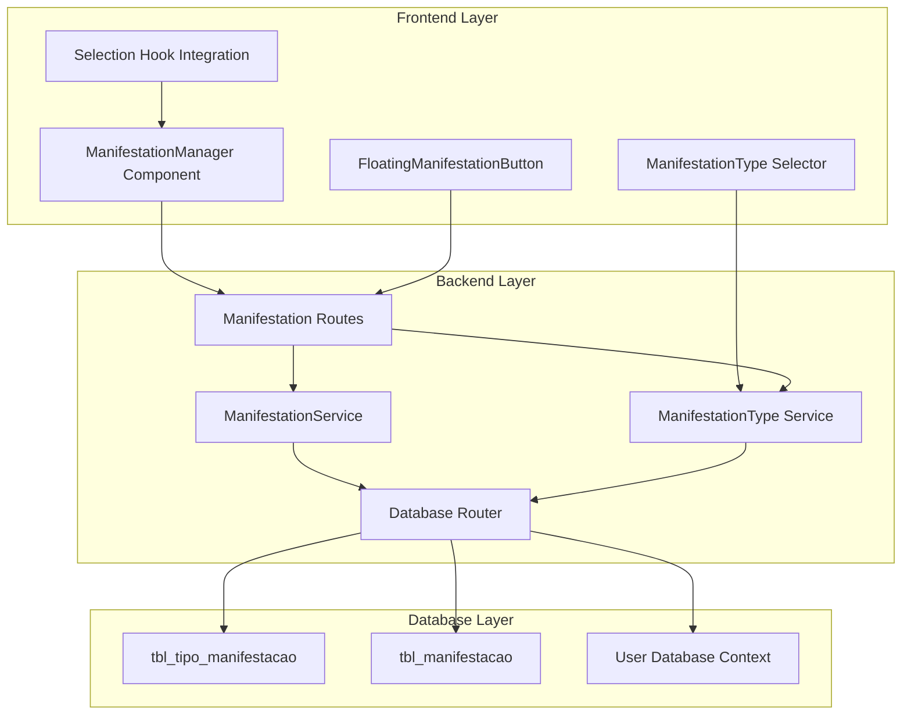

# Design Document: NFe Manifestation Scheduling

## Overview

The NFe Manifestation Scheduling system provides users with the ability to schedule manifestation operations for selected fiscal documents through an intuitive interface that mirrors the existing download functionality. The system integrates seamlessly with the current architecture, utilizing user-based database routing, existing authentication mechanisms, and established UI patterns.

The solution consists of three main components: a frontend manifestation interface with type selection and document management, a backend API service for manifestation scheduling and status tracking, and database integration with SQL Server tables for manifestation types and scheduled operations.

## Architecture

### System Architecture



### Component Integration

The manifestation system integrates with existing components:

- **Selection System**: Reuses the existing `useSelection` hook and grid selection mechanism
- **Authentication**: Leverages existing `AuthContext` and JWT token management
- **Database Routing**: Utilizes the established user-based database routing system
- **HTTP Communication**: Uses the existing `httpService` with request deduplication and caching
- **UI Patterns**: Follows the same design patterns as the download functionality

## Components and Interfaces

### Frontend Components

#### ManifestationManager Component

```typescript
interface ManifestationManagerProps {
  className?: string;
}

interface ManifestationState {
  selectedType: ManifestationType | null;
  isLoading: boolean;
  message: FeedbackMessage | null;
  availableTypes: ManifestationType[];
}

export default function ManifestationManager({ className }: ManifestationManagerProps): JSX.Element
```

**Responsibilities:**
- Manage manifestation type selection
- Display manifestation button when documents are selected
- Handle manifestation confirmation and feedback
- Integrate with existing selection system

#### ManifestationTypeSelector Component

```typescript
interface ManifestationTypeSelectorProps {
  selectedType: ManifestationType | null;
  availableTypes: ManifestationType[];
  onTypeChange: (type: ManifestationType | null) => void;
  disabled?: boolean;
}

export function ManifestationTypeSelector(props: ManifestationTypeSelectorProps): JSX.Element
```

**Responsibilities:**
- Display dropdown with available manifestation types
- Handle type selection changes
- Provide loading and error states
- Validate type selection requirements

#### FloatingManifestationButton Component

```typescript
interface FloatingManifestationButtonProps {
  className?: string;
  stickyTop?: boolean;
  topOffset?: number;
}

export default function FloatingManifestationButton(props: FloatingManifestationButtonProps): JSX.Element
```

**Responsibilities:**
- Display floating manifestation button when documents are selected
- Show document count and manifestation progress
- Provide responsive design for mobile and desktop
- Handle manifestation confirmation workflow

### Backend Services

#### ManifestationService

```typescript
interface ManifestationScheduleParams {
  usrCodigo: string;
  manifestationType: string;
  chaves: string[];
  ip: string;
  requestId?: string;
}

interface ManifestationStatusQuery {
  usrCodigo: string;
  manifestationType?: string;
  status?: string;
  dateFrom?: string;
  dateTo?: string;
}

export class ManifestationService {
  async scheduleManifestations(params: ManifestationScheduleParams): Promise<ServiceResult<ManifestationScheduleResult>>;
  async getManifestationStatus(query: ManifestationStatusQuery): Promise<ServiceResult<ManifestationStatus[]>>;
  async updateManifestationStatus(id: number, status: string, usrCodigo: string): Promise<ServiceResult<void>>;
  async getManifestationTypes(usrCodigo: string): Promise<ServiceResult<ManifestationType[]>>;
}
```

**Responsibilities:**
- Schedule manifestation operations with duplicate prevention
- Query manifestation status with filtering and sorting
- Update manifestation status for external processing
- Load available manifestation types from user's database

#### ManifestationTypeService

```typescript
interface ManifestationType {
  id: string;
  codigo: string;
  descricao: string;
  ativo: boolean;
  ordem?: number;
}

export class ManifestationTypeService {
  async getAvailableTypes(usrCodigo: string): Promise<ServiceResult<ManifestationType[]>>;
  async validateManifestationType(typeId: string, usrCodigo: string): Promise<ServiceResult<boolean>>;
}
```

**Responsibilities:**
- Load manifestation types from tbl_tipo_manifestacao
- Validate manifestation type selections
- Cache manifestation types for performance
- Handle database routing for type queries

### API Endpoints

#### Manifestation Routes

```typescript
// POST /api/manifestations/schedule
interface ScheduleManifestationRequest {
  manifestationType: string;
  chaves: string[];
}

interface ScheduleManifestationResponse {
  success: boolean;
  data?: {
    manifestationId: string;
    totalChaves: number;
    duplicatesSkipped: number;
  };
  error?: string;
}

// GET /api/manifestations/types
interface ManifestationTypesResponse {
  success: boolean;
  data?: ManifestationType[];
  error?: string;
}

// GET /api/manifestations/status
interface ManifestationStatusResponse {
  success: boolean;
  data?: {
    manifestations: ManifestationStatus[];
    pagination?: PaginationInfo;
  };
  error?: string;
}

// PUT /api/manifestations/:id/status
interface UpdateManifestationStatusRequest {
  status: string;
  notes?: string;
}
```

## Data Models

### Database Schema

#### tbl_tipo_manifestacao (Existing)

```sql
CREATE TABLE tbl_tipo_manifestacao (
    id INT IDENTITY(1,1) PRIMARY KEY,
    codigo VARCHAR(10) NOT NULL,
    descricao VARCHAR(100) NOT NULL,
    ativo BIT DEFAULT 1,
    ordem INT DEFAULT 0,
    created_at DATETIME2 DEFAULT GETDATE(),
    updated_at DATETIME2 DEFAULT GETDATE()
);

CREATE INDEX IX_tipo_manifestacao_ativo_ordem ON tbl_tipo_manifestacao (ativo, ordem);
CREATE UNIQUE INDEX IX_tipo_manifestacao_codigo ON tbl_tipo_manifestacao (codigo);
```

#### tbl_manifestacao (Existing/Enhanced)

```sql
CREATE TABLE tbl_manifestacao (
    id BIGINT IDENTITY(1,1) PRIMARY KEY,
    usr_codigo VARCHAR(20) NOT NULL,
    tipo_manifestacao VARCHAR(10) NOT NULL,
    chave_acesso VARCHAR(44) NOT NULL,
    status VARCHAR(10) DEFAULT 'AGENDADO',
    data_agendamento DATETIME2 DEFAULT GETDATE(),
    data_processamento DATETIME2 NULL,
    ip_origem VARCHAR(45) NULL,
    observacoes TEXT NULL,
    created_at DATETIME2 DEFAULT GETDATE(),
    updated_at DATETIME2 DEFAULT GETDATE()
);

-- Performance indexes
CREATE INDEX IX_manifestacao_usuario_status ON tbl_manifestacao (usr_codigo, status);
CREATE INDEX IX_manifestacao_tipo_data ON tbl_manifestacao (tipo_manifestacao, data_agendamento);
CREATE INDEX IX_manifestacao_chave ON tbl_manifestacao (chave_acesso);

-- Unique constraint to prevent duplicates
CREATE UNIQUE INDEX IX_manifestacao_unique ON tbl_manifestacao (usr_codigo, tipo_manifestacao, chave_acesso);
```

### TypeScript Interfaces

#### Core Data Types

```typescript
interface ManifestationType {
  id: string;
  codigo: string;
  descricao: string;
  ativo: boolean;
  ordem?: number;
}

interface ManifestationRecord {
  id: string;
  usrCodigo: string;
  tipoManifestacao: string;
  chaveAcesso: string;
  status: ManifestationStatus;
  dataAgendamento: Date;
  dataProcessamento?: Date;
  ipOrigem?: string;
  observacoes?: string;
}

type ManifestationStatus = 'AGENDADO' | 'PROCESSANDO' | 'CONCLUIDO' | 'ERRO' | 'CANCELADO';

interface ManifestationScheduleResult {
  manifestationId: string;
  totalChaves: number;
  duplicatesSkipped: number;
  scheduledCount: number;
}
```

#### Service Response Types

```typescript
interface ServiceResult<T> {
  success: boolean;
  data?: T;
  error?: string;
  errorCode?: string;
}

interface FeedbackMessage {
  type: 'success' | 'error' | 'info' | 'warning';
  text: string;
  details?: string;
}

interface PaginationInfo {
  page: number;
  pageSize: number;
  totalPages: number;
  totalItems: number;
}
```

## Correctness Properties

*A property is a characteristic or behavior that should hold true across all valid executions of a system-essentially, a formal statement about what the system should do. Properties serve as the bridge between human-readable specifications and machine-verifiable correctness guarantees.*

### Property Reflection

After analyzing all acceptance criteria, I identified several areas where properties can be consolidated:

- Properties related to UI state management (button visibility, enabling/disabling) can be combined into comprehensive state properties
- Database routing properties can be consolidated since they all verify the same underlying mechanism
- Validation properties can be grouped by validation type (input validation, business rule validation, security validation)
- Error handling properties can be combined where they test similar error scenarios

The following properties represent the unique, non-redundant validation requirements:

### Core Functionality Properties

**Property 1: Manifestation Type Loading and Selection**
*For any* user with valid authentication, loading manifestation types should populate the dropdown with types from the user's database context, and selecting a type should enable manifestation functionality
**Validates: Requirements 1.1, 1.3, 1.4**

**Property 2: Document Selection Integration**
*For any* document selection state in the grid, the manifestation button visibility and document count display should accurately reflect the current selection
**Validates: Requirements 2.1, 2.2, 2.3, 5.1, 5.2**

**Property 3: Manifestation Scheduling with Duplicate Prevention**
*For any* valid manifestation request with selected documents and type, scheduling should create unique records in tbl_manifestacao and prevent duplicate entries for the same access key and manifestation type combination
**Validates: Requirements 3.1, 3.2, 6.6**

**Property 4: Database Routing Consistency**
*For any* manifestation operation (loading types, scheduling, status queries), all database operations should target the user's assigned database context
**Validates: Requirements 4.1, 4.2, 4.3, 3.5**

### Validation and Error Handling Properties

**Property 5: Input Validation Completeness**
*For any* manifestation scheduling attempt, the system should validate manifestation type selection, document selection, access key format, and quantity limits before processing
**Validates: Requirements 6.1, 6.2, 6.3, 6.5**

**Property 6: Error Handling and User Feedback**
*For any* error condition (database errors, validation failures, routing failures), the system should log the error appropriately and display user-friendly feedback messages
**Validates: Requirements 1.5, 3.4, 4.5, 6.4**

**Property 7: UI State Management**
*For any* combination of manifestation type selection and document selection states, the UI should correctly enable/disable actions and provide appropriate visual feedback
**Validates: Requirements 1.2, 2.5, 5.3, 5.4, 5.5**

### Integration and Architecture Properties

**Property 8: Existing System Integration**
*For any* manifestation operation, the system should use existing authentication, httpService, selection mechanisms, and follow established API patterns consistently with the download functionality
**Validates: Requirements 7.1, 7.2, 7.3, 7.4**

**Property 9: Data Integrity and Audit**
*For any* manifestation record creation or status update, the system should include all required fields (user code, manifestation type, access key, timestamp) and maintain complete audit trails
**Validates: Requirements 3.6, 9.1, 9.4**

### Performance and Security Properties

**Property 10: Concurrent Operation Safety**
*For any* scenario with multiple users scheduling manifestations simultaneously, the system should handle concurrent operations safely without data corruption or race conditions
**Validates: Requirements 8.3**

**Property 11: Security and Authorization**
*For any* manifestation operation attempt, the system should validate user permissions, prevent security vulnerabilities, and log unauthorized access attempts
**Validates: Requirements 9.2, 9.3, 9.5**

**Property 12: Performance and Scalability**
*For any* large batch of manifestation requests (up to 1000 documents), the system should process them efficiently without blocking other operations and provide progress feedback
**Validates: Requirements 8.1, 8.4**

### Status Management Properties

**Property 13: Status Tracking and Updates**
*For any* scheduled manifestation, the system should assign appropriate initial status values and allow status updates while respecting user database routing and permissions
**Validates: Requirements 10.1, 10.2, 10.3, 10.5**

**Property 14: Query Filtering and Sorting**
*For any* manifestation status query with filtering or sorting parameters, the system should return results that match the specified criteria and maintain proper ordering
**Validates: Requirements 10.4**

**Property 15: Session and Selection Management**
*For any* successful manifestation completion, the system should clear document selection after appropriate delay and maintain session state correctly
**Validates: Requirements 5.6**

## Error Handling

### Error Classification

#### Validation Errors (400 series)
- Missing manifestation type selection
- No documents selected
- Invalid access key format
- Quantity limit exceeded (>1000 documents)
- Duplicate manifestation attempts

#### Authentication/Authorization Errors (401/403)
- Invalid or expired JWT token
- Insufficient user permissions
- Cross-database access attempts

#### Business Logic Errors (422)
- Manifestation type not available for user
- Documents not accessible to user
- Invalid status transitions

#### System Errors (500 series)
- Database connection failures
- SQL Server routing errors
- External service timeouts
- Unexpected application errors

### Error Handling Strategy

```typescript
// Centralized error handling with user-friendly messages
interface ErrorResponse {
  success: false;
  error: string;
  errorCode: string;
  details?: string;
  userMessage: string;
}

// Error mapping for user-friendly messages
const ERROR_MESSAGES = {
  'MANIFESTATION_TYPE_REQUIRED': 'Por favor, selecione um tipo de manifestação antes de continuar.',
  'NO_DOCUMENTS_SELECTED': 'Selecione pelo menos um documento para manifestar.',
  'INVALID_ACCESS_KEY': 'Uma ou mais chaves de acesso possuem formato inválido.',
  'QUANTITY_LIMIT_EXCEEDED': 'Máximo de 1000 documentos por operação de manifestação.',
  'DUPLICATE_MANIFESTATION': 'Alguns documentos já possuem manifestação agendada para este tipo.',
  'DATABASE_ROUTING_ERROR': 'Erro no roteamento de banco de dados. Tente novamente.',
  'INSUFFICIENT_PERMISSIONS': 'Você não possui permissão para esta operação.',
  'MANIFESTATION_TYPE_INVALID': 'Tipo de manifestação selecionado não é válido.',
  'SYSTEM_ERROR': 'Erro interno do sistema. Nossa equipe foi notificada.'
} as const;
```

## Testing Strategy

### Dual Testing Approach

The manifestation system requires both unit testing and property-based testing to ensure comprehensive coverage:

**Unit Tests**: Focus on specific examples, edge cases, and integration points between components. These tests validate concrete scenarios and ensure proper error handling for known failure modes.

**Property Tests**: Verify universal properties across all inputs using randomized test data. These tests ensure the system behaves correctly across the full range of possible inputs and user interactions.

### Property-Based Testing Configuration

All property tests will use **fast-check** library with minimum 100 iterations per test to ensure comprehensive input coverage. Each test will be tagged with references to the design document properties:

```typescript
// Example property test structure
describe('Manifestation Scheduling Properties', () => {
  it('Property 3: Manifestation Scheduling with Duplicate Prevention', async () => {
    // Feature: nfe-manifestation-scheduling, Property 3: For any valid manifestation request with selected documents and type, scheduling should create unique records and prevent duplicates
    await fc.assert(fc.asyncProperty(
      fc.array(fc.string({ minLength: 44, maxLength: 44 }), { minLength: 1, maxLength: 100 }),
      fc.string({ minLength: 1, maxLength: 10 }),
      fc.string({ minLength: 1, maxLength: 20 }),
      async (chaves, manifestationType, usrCodigo) => {
        // Test implementation
      }
    ), { numRuns: 100 });
  });
});
```

### Unit Testing Focus Areas

**Component Testing**:
- ManifestationManager component state management
- ManifestationTypeSelector dropdown behavior
- FloatingManifestationButton visibility and interactions
- Integration with existing selection hooks

**Service Testing**:
- ManifestationService database operations
- ManifestationTypeService caching and validation
- Error handling and logging mechanisms
- Database routing and connection management

**API Testing**:
- Route parameter validation
- Authentication and authorization middleware
- Request/response serialization
- Error response formatting

### Integration Testing

**Database Integration**:
- SQL Server connection and query execution
- Transaction management and rollback scenarios
- Index performance and query optimization
- Concurrent access and locking behavior

**System Integration**:
- End-to-end manifestation workflow
- Integration with existing download system
- Authentication and session management
- Cross-component communication

### Performance Testing

**Load Testing**:
- Concurrent manifestation scheduling (multiple users)
- Large batch processing (up to 1000 documents)
- Database query performance under load
- Memory usage and garbage collection

**Stress Testing**:
- System behavior at capacity limits
- Error recovery and graceful degradation
- Database connection pool exhaustion
- Network timeout and retry scenarios