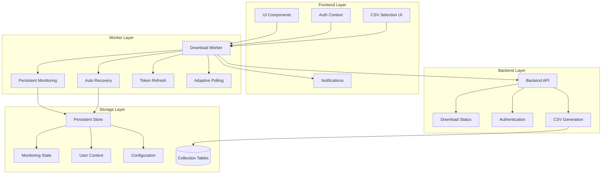

# Design Document - Persistent Download Monitoring System

## Overview

The Persistent Download Monitoring System enhances the existing download monitoring infrastructure to provide continuous, resilient monitoring that survives authentication changes, network failures, and browser session changes. The system implements intelligent retry mechanisms, adaptive polling, and automatic recovery to ensure users never miss download completion notifications. Additionally, the system supports CSV data file inclusion in scheduled downloads, allowing users to receive structured data alongside original documents.

## Architecture

### High-Level Architecture



### Component Interactions

1. **Enhanced Download Worker**: Runs continuously with resilient polling and auto-recovery
2. **Persistent State Manager**: Manages monitoring state across sessions
3. **Token Refresh Handler**: Automatically refreshes expired tokens
4. **Adaptive Polling Controller**: Adjusts polling frequency based on conditions
5. **Recovery Manager**: Handles failures and implements recovery strategies
6. **CSV Selection Manager**: Handles CSV inclusion requests and integrates with download processing
7. **Collection Data Handler**: Manages CSV generation from collection tables (tbl_nfe_100, tbl_cte_100, tbl_cfe_100)

## Components and Interfaces

### Enhanced Download Worker

```typescript
interface PersistentWorkerMessage extends WorkerMessage {
  type: 'INIT' | 'START_MONITORING' | 'PAUSE_MONITORING' | 'RESUME_MONITORING' | 
        'UPDATE_TOKEN' | 'UPDATE_CONFIG' | 'GET_STATUS' | 'FORCE_CHECK' |
        'UPDATE_CSV_SELECTION' | 'GET_CSV_STATUS'
  payload?: {
    usrCodigo?: string
    authToken?: string
    baseURL?: string
    config?: MonitoringConfig
    persistent?: boolean
    csvSelection?: CSVSelectionConfig
  }
}

interface CSVSelectionConfig {
  includeNFeCSV: boolean
  includeCTeCSV: boolean
  includeCFeCSV: boolean
  filterCriteria?: FilterCriteria
}

interface FilterCriteria {
  dateRange?: {
    startDate: string
    endDate: string
  }
  documentTypes?: string[]
  status?: string[]
  // Additional filter criteria as needed
}

interface MonitoringConfig {
  basePollingInterval: number
  maxPollingInterval: number
  minPollingInterval: number
  maxRetries: number
  backoffMultiplier: number
  adaptivePolling: boolean
  persistAcrossSessions: boolean
}
```

### Persistent State Manager

```typescript
interface MonitoringState {
  isActive: boolean
  usrCodigo: string | null
  lastSuccessfulCheck: number
  consecutiveFailures: number
  currentPollingInterval: number
  config: MonitoringConfig
  pausedAt?: number
  resumeAfterAuth?: boolean
}

class PersistentStateManager {
  saveState(state: MonitoringState): void
  loadState(): MonitoringState | null
  clearState(): void
  updateState(partial: Partial<MonitoringState>): void
}
```

### Token Refresh Handler

```typescript
interface TokenRefreshHandler {
  refreshToken(): Promise<string | null>
  scheduleRefresh(expiresIn: number): void
  onTokenRefreshed(callback: (token: string) => void): void
  onRefreshFailed(callback: (error: Error) => void): void
}
```

### CSV Selection Manager

```typescript
interface CSVSelectionManager {
  updateCSVSelection(selection: CSVSelectionConfig): Promise<void>
  getCSVStatus(): CSVSelectionConfig
  markCSVInDatabase(documentType: 'nfe' | 'cte' | 'cfe', enabled: boolean): Promise<void>
  validateCSVRequest(selection: CSVSelectionConfig): boolean
}

interface CSVGenerationRequest {
  documentType: 'nfe' | 'cte' | 'cfe'
  collectionTable: 'tbl_nfe_100' | 'tbl_cte_100' | 'tbl_cfe_100'
  filterCriteria: FilterCriteria
  usrCodigo: string
  downloadId: string
}
```

**Design Rationale**: The CSV Selection Manager provides a clean interface for managing CSV inclusion requests. It integrates with the existing download system by updating the CSV column in the tbl_nfe_dow table, which the download bot uses to determine whether to include CSV files in the generated ZIP.

### Adaptive Polling Controller

```typescript
class AdaptivePollingController {
  calculateNextInterval(
    consecutiveFailures: number,
    hasActiveDownloads: boolean,
    lastResponseTime: number
  ): number
  
  shouldReduceFrequency(conditions: {
    consecutiveEmptyResponses: number
    isTabActive: boolean
    systemLoad: number
  }): boolean
  
  getOptimalInterval(context: PollingContext): number
}
```

## Data Models

### Enhanced Worker State

```typescript
interface EnhancedWorkerState {
  // Core state
  isMonitoring: boolean
  isPersistent: boolean
  usrCodigo: string | null
  authToken: string | null
  baseURL: string
  
  // Resilience state
  consecutiveFailures: number
  lastSuccessfulCheck: Date | null
  currentPollingInterval: number
  retryCount: number
  
  // Adaptive behavior
  consecutiveEmptyResponses: number
  averageResponseTime: number
  hasActiveDownloads: boolean
  
  // Configuration
  config: MonitoringConfig
  
  // Recovery state
  isRecovering: boolean
  recoveryStartTime: Date | null
  tokenRefreshInProgress: boolean
  
  // CSV selection state
  csvSelection: CSVSelectionConfig
  csvRequestsPending: number
}
```

### Monitoring Statistics

```typescript
interface MonitoringStatistics {
  totalChecks: number
  successfulChecks: number
  failedChecks: number
  downloadsDetected: number
  csvDownloadsRequested: number
  csvDownloadsCompleted: number
  averageResponseTime: number
  uptime: number
  lastError: string | null
  currentStatus: 'active' | 'paused' | 'recovering' | 'error'
}
```

## Correctness Properties

*A property is a characteristic or behavior that should hold true across all valid executions of a system-essentially, a formal statement about what the system should do. Properties serve as the bridge between human-readable specifications and machine-verifiable correctness guarantees.*

### Property 1: Token Refresh Resilience
*For any* authentication token expiration event, the system should automatically attempt token refresh and continue monitoring without permanent failure
**Validates: Requirements 1.1, 1.2, 1.3, 1.4, 1.5**

### Property 2: Network Failure Recovery
*For any* network connectivity issue or failure, the system should implement exponential backoff, continue monitoring with degraded performance, and automatically recover when connectivity is restored
**Validates: Requirements 2.1, 2.2, 2.3, 2.4, 2.5**

### Property 3: Session Persistence
*For any* browser session change (refresh, navigation, tab visibility), the monitoring should persist state and continue operation with appropriate adaptations
**Validates: Requirements 3.1, 3.2, 3.3, 3.4, 3.5**

### Property 4: Adaptive Resource Management
*For any* system condition change (download activity, resource constraints, server responses), the polling behavior should adapt appropriately while maintaining monitoring continuity
**Validates: Requirements 4.1, 4.2, 4.3, 4.4, 4.5**

### Property 5: Comprehensive Logging
*For any* monitoring event, error, state change, or performance metric, the system should generate appropriate logs with timestamps and contextual information
**Validates: Requirements 5.1, 5.2, 5.3, 5.4, 5.5**

### Property 6: Manual Control Responsiveness
*For any* manual control action (pause, resume, configure, status check, force check), the system should respond appropriately while preserving monitoring state and configuration
**Validates: Requirements 6.1, 6.2, 6.3, 6.4, 6.5**

### Property 7: Authentication Integration
*For any* authentication state change (login, logout, context update, token refresh), the monitoring should integrate seamlessly with the authentication system and notification system
**Validates: Requirements 7.1, 7.2, 7.3, 7.4, 7.5**

### Property 8: CSV Integration
*For any* CSV selection made by the user, the system should correctly mark the CSV column in the database and ensure CSV files are included in the generated download when the download bot processes the request
**Validates: Requirements 8.2, 8.3, 8.7, 8.8**

### Property 9: CSV Collection Data Handling
*For any* document type (NFe, CTe, CFe) with CSV enabled, the system should generate CSV files from the correct collection table (tbl_nfe_100, tbl_cte_100, tbl_cfe_100) with proper filtering
**Validates: Requirements 8.4, 8.5, 8.6, 8.7**

## Error Handling

### Error Categories and Recovery Strategies

1. **Authentication Errors (401, 403)**
   - Trigger automatic token refresh
   - Pause monitoring during refresh
   - Resume with new token
   - Fallback to user re-authentication if refresh fails

2. **Network Errors (Connection, Timeout)**
   - Implement exponential backoff
   - Reduce polling frequency temporarily
   - Continue monitoring with degraded performance
   - Resume normal operation when connectivity restored

3. **Server Errors (5xx)**
   - Implement retry with backoff
   - Reduce server load by increasing intervals
   - Log errors for debugging
   - Continue monitoring with reduced frequency

4. **Rate Limiting (429)**
   - Respect server-provided retry-after headers
   - Automatically adjust polling intervals
   - Implement adaptive backoff
   - Resume normal polling when limits reset

5. **Worker Errors**
   - Restart worker automatically
   - Preserve monitoring state
   - Log error details
   - Notify main thread of recovery actions

6. **CSV Generation Errors**
   - Handle collection table access failures gracefully
   - Provide fallback when CSV generation fails
   - Log CSV-specific errors with context
   - Continue download processing without CSV if generation fails
   - Notify user of CSV generation issues

## Testing Strategy

### Unit Testing Approach

- Test individual components (StateManager, TokenRefresh, AdaptivePolling, CSVSelectionManager)
- Mock external dependencies (localStorage, fetch, timers, database connections)
- Test error conditions and edge cases
- Verify state transitions and recovery logic
- Test CSV selection and database integration logic

### Property-Based Testing Approach
- Use **fast-check** library for property-based testing
- Generate random sequences of events (network failures, token expiry, user actions)
- Verify that monitoring properties hold across all generated scenarios
- Test with minimum 100 iterations per property
- Each property test will be tagged with: **Feature: persistent-download-monitoring, Property {number}: {property_text}**

### Integration Testing

- Test worker-service communication
- Test persistence across browser sessions
- Test authentication integration
- Test notification system integration
- Test CSV selection UI integration with backend processing
- Test database table updates for CSV requests

### End-to-End Testing

- Test complete user workflows
- Test recovery scenarios
- Test performance under various conditions
- Test manual control functionality
- Test CSV download workflows from selection to ZIP file generation
- Test CSV generation from different collection tables (NFe, CTe, CFe)

## Performance Considerations

### Resource Optimization
- Implement intelligent polling intervals based on activity
- Use efficient storage mechanisms for state persistence
- Minimize memory usage in worker
- Optimize network requests with appropriate caching

### Scalability
- Support multiple concurrent users
- Handle high-frequency polling efficiently
- Manage worker lifecycle properly
- Implement proper cleanup mechanisms

### Monitoring and Metrics
- Track polling frequency and response times
- Monitor error rates and recovery success
- Measure resource usage
- Provide performance diagnostics

## Security Considerations

### Token Management
- Secure storage of authentication tokens
- Automatic token refresh without exposing credentials
- Proper token cleanup on logout
- Protection against token leakage

### Data Protection

- Encrypt sensitive data in persistent storage
- Validate all incoming data from worker
- Sanitize error messages to prevent information disclosure
- Implement proper access controls
- Protect CSV data during generation and transmission
- Ensure CSV files contain only authorized user data

### Network Security
- Use HTTPS for all API communications
- Validate server certificates
- Implement request signing if required
- Protect against man-in-the-middle attacks