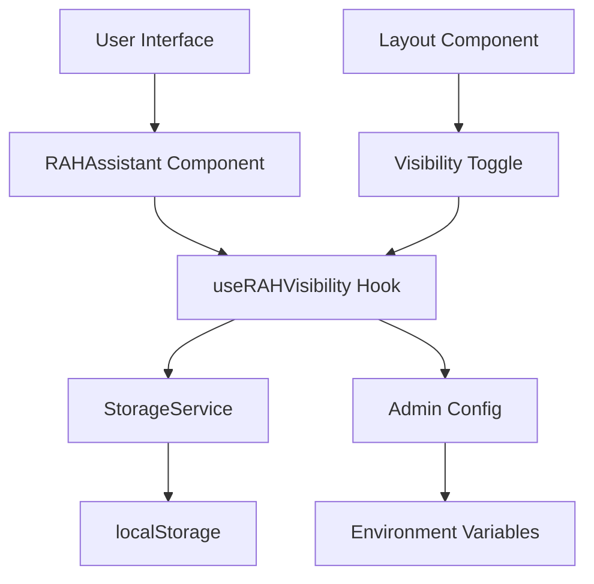

# Design Document

## Overview

Este documento descreve o design para implementar controle de visibilidade do componente RAH - Assistente IA no SpedRevio. A solução permitirá que usuários ocultem/mostrem o assistente através de preferências persistentes, com suporte a controle administrativo global.

## Architecture

A arquitetura seguirá o padrão já estabelecido no sistema, utilizando:

- **React Hooks** para gerenciamento de estado local
- **StorageService** existente para persistência de preferências
- **Context API** para compartilhamento de estado global (se necessário)
- **Componente condicional** para renderização baseada em preferências



## Components and Interfaces

### 1. useRAHVisibility Hook

Hook customizado para gerenciar o estado de visibilidade do RAH Assistant:

```typescript
interface RAHVisibilityState {
  isVisible: boolean
  isGloballyEnabled: boolean
  toggleVisibility: () => void
  setVisibility: (visible: boolean) => void
}

function useRAHVisibility(): RAHVisibilityState
```

### 2. RAHVisibilityToggle Component

Componente para alternar a visibilidade quando o assistente está oculto:

```typescript
interface RAHVisibilityToggleProps {
  className?: string
  position?: 'bottom-right' | 'top-right' | 'custom'
}

function RAHVisibilityToggle(props: RAHVisibilityToggleProps): JSX.Element
```

### 3. Enhanced RAHAssistant Component

O componente existente será modificado para:
- Integrar com o hook `useRAHVisibility`
- Incluir opção de ocultar no header
- Renderizar condicionalmente baseado nas preferências

### 4. Storage Interface

Extensão do StorageService existente para gerenciar preferências:

```typescript
interface RAHPreferences {
  isVisible: boolean
  lastToggled: string
}

// Chaves de storage
const RAH_VISIBILITY_KEY = 'revio_rah_visibility'
const RAH_GLOBAL_ENABLED_KEY = 'revio_rah_global_enabled'
```

## Data Models

### RAH Visibility Preference

```typescript
interface RAHVisibilityPreference {
  isVisible: boolean
  lastToggled: Date
  version: string // Para futuras migrações
}
```

### Admin Configuration

```typescript
interface RAHAdminConfig {
  globallyEnabled: boolean
  allowUserToggle: boolean
  defaultVisibility: boolean
}
```

## Correctness Properties

*A property is a characteristic or behavior that should hold true across all valid executions of a system-essentially, a formal statement about what the system should do. Properties serve as the bridge between human-readable specifications and machine-verifiable correctness guarantees.*

Agora vou usar a ferramenta de prework para analisar os critérios de aceitação:

### Property Reflection

Após revisar todas as propriedades identificadas no prework, identifiquei algumas redundâncias que podem ser consolidadas:

- Propriedades 1.2, 2.3 e 2.4 podem ser combinadas em uma propriedade abrangente sobre o comportamento do toggle
- Propriedades 4.1, 4.2 e 4.3 podem ser combinadas em uma propriedade sobre a hierarquia de storage
- Propriedades 2.1 e 2.2 podem ser combinadas em uma propriedade sobre a disponibilidade de controles de UI

### Converting EARS to Properties

Baseado na análise de prework, aqui estão as propriedades de correção:

**Property 1: Toggle functionality works correctly**
*For any* initial visibility state, when a user clicks the toggle, the RAH Assistant visibility should change to the opposite state immediately with visual feedback
**Validates: Requirements 1.2, 2.3, 2.4**

**Property 2: Persistence hierarchy works correctly**
*For any* user session, when visibility preference is changed, the system should store it using the first available storage method in order: localStorage, sessionStorage, then in-memory state
**Validates: Requirements 4.1, 4.2, 4.3**

**Property 3: Visibility state persistence across sessions**
*For any* user with stored visibility preference, when the page is refreshed or reloaded, the RAH Assistant should maintain the same visibility state as before the reload
**Validates: Requirements 1.3, 1.4**

**Property 4: UI controls availability matches state**
*For any* visibility state, the appropriate control should be available: hide option when visible, show option when hidden
**Validates: Requirements 2.1, 2.2**

**Property 5: Hidden state renders correctly**
*For any* session where RAH Assistant is hidden, no floating button should appear in the bottom-right corner
**Validates: Requirements 1.5**

**Property 6: Global admin control overrides user preferences**
*For any* user preference setting, when admin globally disables the RAH Assistant, the component should not appear regardless of user preference
**Validates: Requirements 3.1**

**Property 7: Global enable respects user preferences**
*For any* user with stored visibility preference, when admin globally enables the RAH Assistant, the component visibility should match the user's stored preference
**Validates: Requirements 3.2**

**Property 8: Global disable hides user controls**
*For any* user interface, when RAH Assistant is globally disabled, no user preference controls should be displayed
**Validates: Requirements 3.3**

**Property 9: Storage error handling**
*For any* storage operation that fails, the system should continue to function and maintain state in the next available storage method
**Validates: Requirements 4.5**

## Error Handling

### Storage Failures
- **localStorage unavailable**: Fallback to sessionStorage
- **sessionStorage unavailable**: Fallback to in-memory state
- **Storage quota exceeded**: Clear old preferences and retry
- **Storage corruption**: Reset to default preferences

### Component Failures
- **RAH Assistant crash**: Hide component and show error boundary
- **Toggle malfunction**: Reset to default state and log error
- **Preference loading failure**: Use default visibility

### Network/Admin Config Failures
- **Admin config unavailable**: Use cached config or default to enabled
- **Config sync failure**: Continue with last known config

## Testing Strategy

### Dual Testing Approach

The system will use both unit tests and property-based tests for comprehensive coverage:

**Unit Tests** will focus on:
- Default visibility on first access (Requirements 1.1)
- Specific error scenarios and edge cases
- Component integration points
- Storage fallback scenarios

**Property-Based Tests** will focus on:
- Universal properties that hold across all inputs
- Toggle behavior across all possible states
- Persistence behavior across all user sessions
- Admin control behavior across all configurations

### Property-Based Testing Configuration

- **Testing Library**: React Testing Library with @fast-check/jest for property-based testing
- **Minimum Iterations**: 100 iterations per property test
- **Test Tags**: Each property test will reference its design document property using the format:
  - **Feature: rah-assistant-visibility-control, Property 1: Toggle functionality works correctly**

### Test Implementation Requirements

Each correctness property MUST be implemented by a SINGLE property-based test that:
1. Generates random test inputs appropriate to the property
2. Executes the system behavior being tested
3. Verifies the property holds true
4. References the specific design document property in comments
5. Runs a minimum of 100 iterations to ensure comprehensive coverage

Unit tests and property tests are complementary - unit tests catch concrete bugs and test specific examples, while property tests verify general correctness across many inputs.