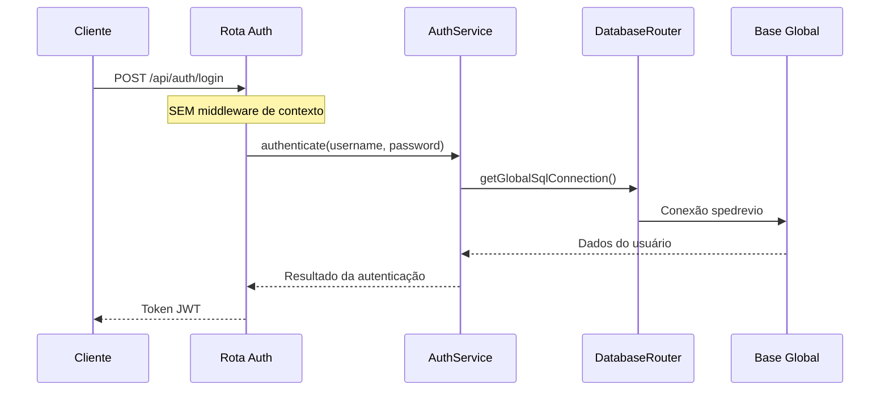

# Serviços de Autenticação - Uso de Base Global

## Visão Geral

Este documento documenta as exceções para serviços de autenticação no sistema de roteamento automático de bases de dados. Os serviços de autenticação são os únicos componentes que **sempre** usam a base global (`spedrevio`), independente do contexto de usuário autenticado.

## Serviços de Autenticação

### 1. AuthService

**Localização**: `src/backend/services/AuthService.ts`

**Responsabilidades**:
- Validação de credenciais de usuário
- Verificação de permissões de acesso
- Verificação de status da base de dados
- Autenticação completa (credenciais + status + permissões)

**Uso de Base Global**:
- ✅ **SEMPRE** usa `databaseRouter.getGlobalSqlConnection()`
- ✅ **NUNCA** usa conexões específicas de cliente
- ✅ **INDEPENDENTE** do contexto de usuário configurado

**Métodos que usam base global**:
```typescript
// Validação de credenciais na tabela fr_usuario
async validateCredentials(username: string, password: string)

// Verificação de permissões na tabela fr_usuario_sistema  
async checkPermissions(usrCodigo: string)

// Autenticação completa
async authenticate(username: string, password: string)
```

**Justificativa**:
- Dados de autenticação (usuários, senhas, permissões) estão centralizados na base global
- Necessário para permitir login de usuários de diferentes clientes
- Evita dependência circular (não pode depender do usuário estar autenticado para autenticar)

### 2. TokenManager

**Localização**: `src/backend/services/TokenManager.ts`

**Responsabilidades**:
- Geração de tokens JWT
- Validação de tokens JWT
- Renovação de tokens próximos ao vencimento
- Decodificação de tokens para debug

**Uso de Base Global**:
- ✅ **INDEPENDENTE** de qualquer base de dados
- ✅ **STATELESS** - não acessa banco de dados
- ✅ **FUNCIONA** sem contexto de usuário

**Métodos independentes de base**:
```typescript
// Geração de token (apenas criptografia)
generateToken(user: UserData): string

// Validação de token (apenas criptografia)
validateToken(token: string): TokenValidationResult

// Renovação de token (apenas criptografia)
refreshTokenIfNeeded(token: string): string | null

// Decodificação de token (apenas criptografia)
decodeToken(token: string): any
```

**Justificativa**:
- Operações puramente criptográficas usando JWT
- Não requer acesso a base de dados
- Deve funcionar independente do estado do sistema

### 3. Rotas de Autenticação

**Localização**: `src/backend/routes/auth.ts`

**Rotas que usam base global**:
- `POST /api/auth/login` - Login de usuário
- `POST /api/auth/logout` - Logout de usuário  
- `GET /api/auth/me` - Dados do usuário autenticado
- `POST /api/auth/verify` - Verificação de token
- `POST /api/auth/refresh` - Renovação de token

**Uso de Base Global**:
- ✅ **SEMPRE** chamam `AuthService` e `TokenManager`
- ✅ **NUNCA** usam conexões específicas de cliente
- ✅ **INDEPENDENTE** do middleware de contexto de usuário

**Justificativa**:
- Rotas de autenticação devem funcionar antes do usuário estar autenticado
- Não podem depender do contexto de usuário para funcionar
- Precisam acessar dados centralizados de autenticação

## Exceções ao Roteamento Automático

### Middleware de Contexto

Os serviços de autenticação são **EXCLUÍDOS** do middleware de contexto de usuário:

```typescript
// UserContextMiddleware NÃO é aplicado às rotas de autenticação
app.use('/api/auth', authRoutes) // SEM middleware de contexto
app.use('/api/downloads', userContextMiddleware, downloadRoutes) // COM middleware
```

### DatabaseRouter

O `DatabaseRouter` fornece métodos específicos para base global:

```typescript
// Método usado APENAS por serviços de autenticação
getGlobalSqlConnection(): PrismaClient | null

// Métodos context-aware usados por outros serviços
getCurrentSqlConnection(): PrismaClient | null
getCurrentMongoConnection(): mongoose.Connection
```

## Validação e Testes

### Testes de Isolamento

Os testes garantem que os serviços de autenticação:

1. **Sempre usam base global** mesmo com contexto de cliente configurado
2. **Funcionam independente** do contexto de usuário
3. **Não são afetados** por mudanças de contexto
4. **Mantêm isolamento** de outros serviços

### Testes de Propriedades

**Propriedade 15**: Serviços de autenticação usam base global
- **Valida**: Requisitos 8.4
- **Garante**: AuthService sempre usa `getGlobalSqlConnection()`
- **Garante**: TokenManager funciona sem base de dados
- **Garante**: Rotas de autenticação usam base global

### Arquivos de Teste

- `src/backend/tests/auth-services.test.ts` - Testes dos serviços
- `src/backend/tests/auth-routes.test.ts` - Testes das rotas

## Fluxo de Autenticação



## Considerações de Segurança

### Isolamento de Dados

- ✅ Dados de autenticação ficam isolados na base global
- ✅ Credenciais não ficam espalhadas em bases de clientes
- ✅ Controle centralizado de permissões e acessos

### Auditoria

- ✅ Todos os eventos de autenticação são registrados na base global
- ✅ Logs de login/logout ficam centralizados
- ✅ Rastreabilidade completa de acessos

### Disponibilidade

- ✅ Autenticação funciona mesmo se bases de clientes estiverem indisponíveis
- ✅ Sistema de fallback não afeta autenticação
- ✅ Login sempre disponível para todos os usuários

## Manutenção e Evolução

### Adicionando Novos Serviços de Autenticação

1. **SEMPRE** usar `databaseRouter.getGlobalSqlConnection()`
2. **NUNCA** usar métodos context-aware
3. **EXCLUIR** do middleware de contexto de usuário
4. **ADICIONAR** testes de isolamento
5. **DOCUMENTAR** como exceção ao roteamento automático

### Modificando Serviços Existentes

1. **MANTER** uso da base global
2. **VALIDAR** que não há dependência de contexto
3. **ATUALIZAR** testes se necessário
4. **REVISAR** documentação

## Resumo

Os serviços de autenticação são a **única exceção** ao sistema de roteamento automático de bases de dados. Esta exceção é:

- **Necessária** para o funcionamento do sistema
- **Documentada** e testada adequadamente  
- **Isolada** do resto da aplicação
- **Segura** e auditável
- **Mantida** de forma consistente

Todos os outros serviços devem seguir o padrão de roteamento automático baseado no contexto de usuário.