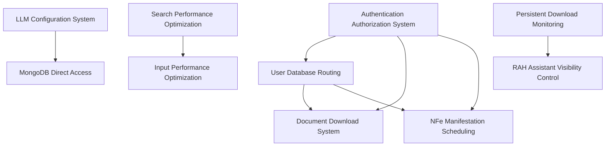

# Resumo do Status das Especificações do Projeto

## Visão Geral

Este documento apresenta um resumo do status atual de todas as especificações do projeto, organizadas por prioridade e estado de implementação.

## Especificações Completas ✅

### 1. NFe Configurable Grouping ✅
- **Status**: Implementação Completa
- **Localização**: `.kiro/specs/nfe-configurable-grouping/`
- **Funcionalidades**: Sistema de agrupamento configurável para NFe com controle global e por coleção
- **Testes**: Property-based tests implementados e passando
- **Próximos Passos**: Nenhum - sistema pronto para produção

### 2. DANFE Viewer ✅
- **Status**: Implementação Completa
- **Localização**: `.kiro/specs/danfe-viewer/`
- **Funcionalidades**: Visualizador de DANFE com geração de PDF, cache inteligente e interface modal
- **Arquitetura**: Migrado para nfe-danfe-pdf, estrutura monorepo, render-once pattern
- **Próximos Passos**: Sistema pronto para produção

## Especificações com Requisitos e Design Completos 📋

### 3. Authentication Authorization System 📋
- **Status**: Requisitos, Design e Tarefas Definidos
- **Localização**: `.kiro/specs/authentication-authorization-system/`
- **Funcionalidades**: Sistema completo de autenticação com RBAC, MFA, auditoria
- **Próximos Passos**: Implementação das tarefas definidas

### 4. User Database Routing 📋
- **Status**: Requisitos, Design e Tarefas Definidos
- **Localização**: `.kiro/specs/user-database-routing/`
- **Funcionalidades**: Roteamento automático de banco de dados por usuário/tenant
- **Próximos Passos**: Implementação das tarefas definidas

### 5. LLM Configuration System 📋
- **Status**: Requisitos, Design e Tarefas Definidos
- **Localização**: `.kiro/specs/llm-configuration-system/`
- **Funcionalidades**: Sistema de configuração multi-provider para LLM com quotas e auditoria
- **Próximos Passos**: Implementação das tarefas definidas

### 6. MongoDB Direct Access 📋
- **Status**: Requisitos, Design e Tarefas Definidos
- **Localização**: `.kiro/specs/mongodb-direct-access/`
- **Funcionalidades**: Acesso direto ao MongoDB com cache, mapeamento e busca natural
- **Dependências**: LLM Configuration System
- **Próximos Passos**: Implementação após LLM Configuration System

### 7. Document Download System 📋
- **Status**: Requisitos, Design e Tarefas Definidos
- **Localização**: `.kiro/specs/document-download-system/`
- **Funcionalidades**: Sistema de download de documentos com seleção múltipla e agendamento
- **Próximos Passos**: Implementação das tarefas definidas

### 8. NFe Manifestation Scheduling 📋
- **Status**: Requisitos, Design e Tarefas Definidos
- **Localização**: `.kiro/specs/nfe-manifestation-scheduling/`
- **Funcionalidades**: Agendamento de manifestações NFe com tipos configuráveis
- **Próximos Passos**: Implementação das tarefas definidas

### 9. RAH Assistant Visibility Control 📋
- **Status**: Requisitos, Design e Tarefas Definidos
- **Localização**: `.kiro/specs/rah-assistant-visibility-control/`
- **Funcionalidades**: Controle de visibilidade do assistente IA com persistência
- **Próximos Passos**: Implementação das tarefas definidas

## Especificações com Requisitos e Tarefas Criados 📝

### 10. Search Performance Optimization 📝
- **Status**: Requisitos e Tarefas Criados
- **Localização**: `.kiro/specs/search-performance-optimization/`
- **Funcionalidades**: Otimização de performance de busca com debounce, cache e busca por voz
- **Próximos Passos**: Criar documento de design

### 11. Persistent Download Monitoring 📝
- **Status**: Requisitos e Tarefas Criados
- **Localização**: `.kiro/specs/persistent-download-monitoring/`
- **Funcionalidades**: Monitoramento persistente de downloads com Service Workers
- **Próximos Passos**: Criar documento de design

### 12. Input Performance Optimization 📝
- **Status**: Requisitos, Design e Tarefas Definidos
- **Localização**: `.kiro/specs/input-performance-optimization/`
- **Funcionalidades**: Otimização de performance de inputs com throttling e cache
- **Próximos Passos**: Implementação das tarefas definidas

## Priorização Recomendada

### Prioridade Alta (Implementar Primeiro) 🔥

1. **Authentication Authorization System** - Base para segurança do sistema
2. **User Database Routing** - Isolamento de dados por cliente
3. **LLM Configuration System** - Base para funcionalidades de IA

### Prioridade Média (Implementar em Seguida) ⚡

4. **MongoDB Direct Access** - Melhoria de performance (depende de LLM)
5. **Document Download System** - Funcionalidade importante para usuários
6. **NFe Manifestation Scheduling** - Funcionalidade específica do domínio fiscal

### Prioridade Baixa (Implementar por Último) 📈

7. **Search Performance Optimization** - Melhorias de UX
8. **Input Performance Optimization** - Melhorias de UX
9. **Persistent Download Monitoring** - Funcionalidade avançada
10. **RAH Assistant Visibility Control** - Controle de interface

## Dependências Entre Especificações

## Métricas de Progresso

### Especificações por Status
- **Completas**: 2/12 (17%)
- **Prontas para Implementação**: 7/12 (58%)
- **Em Definição**: 3/12 (25%)

### Documentação por Tipo
- **Requirements.md**: 12/12 (100%)
- **Design.md**: 10/12 (83%)
- **Tasks.md**: 12/12 (100%)

### Estimativa de Implementação
- **Especificações Completas**: 0 sprints
- **Prioridade Alta**: 6-8 sprints
- **Prioridade Média**: 4-6 sprints
- **Prioridade Baixa**: 4-6 sprints
- **Total Estimado**: 14-20 sprints

## Recomendações

### Para Próxima Sprint
1. Iniciar implementação do **Authentication Authorization System**
2. Completar design do **Search Performance Optimization**
3. Revisar e refinar tarefas do **User Database Routing**

### Para Médio Prazo
1. Estabelecer pipeline de CI/CD para testes automatizados
2. Implementar monitoramento de performance para especificações críticas
3. Criar documentação de arquitetura unificada

### Para Longo Prazo
1. Avaliar necessidade de novas especificações baseadas em feedback de usuários
2. Otimizar especificações existentes baseado em métricas de uso
3. Considerar migração para arquiteturas mais avançadas (microserviços, etc.)

## Conclusão

O projeto possui uma base sólida de especificações bem documentadas, com 2 especificações já implementadas e funcionais. A priorização sugerida foca primeiro na segurança e isolamento de dados, seguida por funcionalidades de negócio e finalmente melhorias de UX.

A estrutura de monorepo já estabelecida e as práticas de property-based testing implementadas fornecem uma base sólida para o desenvolvimento das especificações restantes.